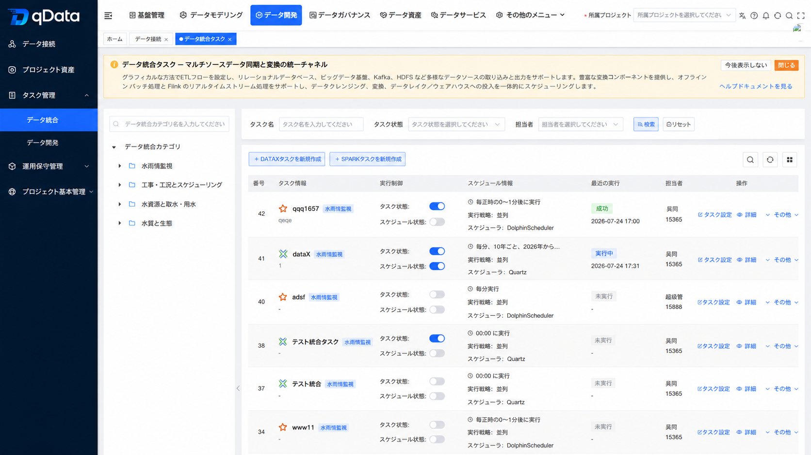
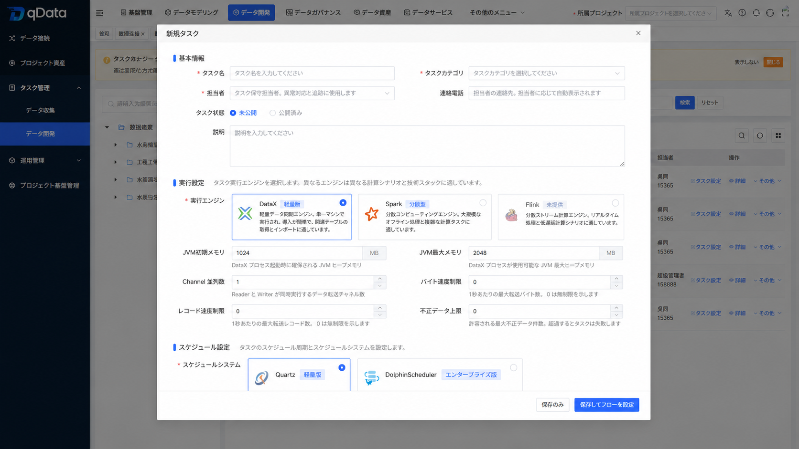
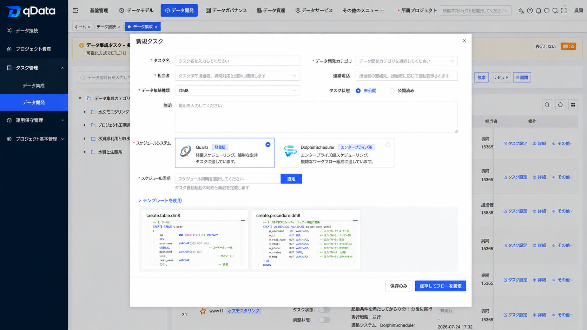
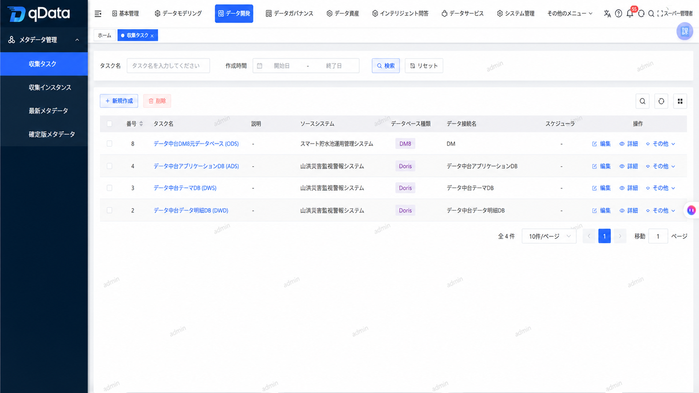
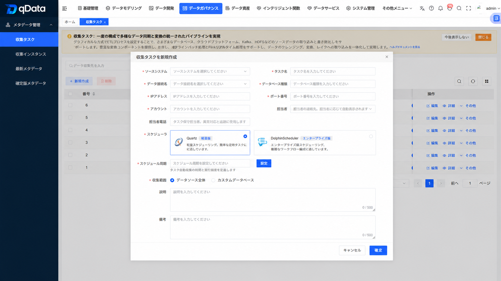

  
 
 
 
 

 
 
 

  <a href="README.zh-CN.md">📖简体中文</a> | <a href="README.md">📖English</a> | 📖日本語

## 🌈 プラットフォーム概要
**qData データ中台**は、企業のデータガバナンスとデータ開発向けのオープンソースデータ中台です。**ETLデータ連携、データ開発、データモデリング、メタデータ管理、データ品質、データ資産、APIデータサービス、AIデータ問答**などの中核機能を備え、MySQL、DM8、Oracle、SQL Server、Kingbase8、Dorisなどの一般的なデータベースへの接続をサポートしています。qDataは、データ接続、クレンジング・変換、資産カタログ化、品質チェック、API公開、Text2SQL分析を企業が迅速に実施できるよう支援します。企業のデータ中台、データガバナンスプラットフォーム、ETLプラットフォーム、データサービスプラットフォームを構築するためのオープンソース基盤として活用でき、開発者による二次開発や機能拡張にも適しています。

✨✨✨**オンラインドキュメント**✨✨✨ <a href="https://community.qdata.tech" target="_blank">https://community.qdata.tech</a>

✨✨✨**オープンソース版デモ**✨✨✨ <a href="https://demo.qdata.tech" target="_blank">https://demo.qdata.tech</a>、ユーザー名：qData、パスワード：qData123

✨✨✨**プロフェッショナル版デモ**✨✨✨ <a href="https://pro-demo.qdata.tech" target="_blank">https://pro-demo.qdata.tech</a>。デモアカウントの取得は[カスタマーサービスにお問い合わせ](https://community.qdata.tech/business/policy.html)ください。

> qDataがお役に立ちましたら、**Star ⭐️**をいただけますと幸いです。それが私たちが継続的に改善する最大の原動力となります！ 🚀

## ✅ 機能一覧

> 👉 qDataデータ中台はモジュール設計を採用しています。現在のオープンソース版は、データ連携、データ開発、データモデリング、メタデータ、データ品質、データ資産、データサービス、AIデータ問答などの中核機能に注力しています。詳細は、[qData機能一覧](https://community.qdata.tech/business/pro/features.html)をご覧ください。

| モジュール | 説明 |
| --- | --- |
| **データ連携（ETL）** | データ取り込み、クレンジング、変換、出力のワークフローを視覚的に設定できます。新規タスクではDataXまたはSparkを実行エンジンとして選択でき、軽量なデータ同期、関連データの取得、データインポート、大規模なオフライン処理、複雑な計算に適しています。 |
| **データ開発** | SQLスクリプト方式でのデータ処理タスク開発をサポート。新規タスク作成時にQuartzまたはDolphinSchedulerスケジューラを選択でき、データ加工、統計分析、定期スケジューリング、タスクオーケストレーションに適用。 |
| **データモデリング** | データ標準、データウェアハウスのレイヤー、データドメイン、サブジェクト領域の設計、論理モデル、標準データ要素などをサポートし、企業の基礎的なデータモデル体系の構築を支援します。 |
| **メタデータ管理** | メタデータ閲覧、フィールド構造閲覧、バージョン管理、メタデータ比較、収集タスク管理をサポート。新規収集タスク作成時にQuartzまたはDolphinSchedulerスケジューラを選択でき、収集実行戦略を柔軟に設定可能。 |
| **データ品質** | 検査ルールに基づくデータ品質チェックと処理をサポートし、完全性、一意性、有効性などの問題を検出可能。 |
| **データ資産** | データ資産カタログ、資産タグ、資産詳細、資産検索などの機能をサポートし、ユーザーがデータ資源を統合管理・検索できるよう支援。 |
| **データ照会** | データソースに対するオンラインSQLクエリをサポートし、一時照会、データ検証、結果エクスポートに活用可能。 |
| **データサービス** | データテーブルやSQLクエリ結果をAPIサービスとしてカプセル化し、オンラインテスト、呼び出しログ、アプリケーション管理機能を提供。 |
| **AIデータ問答** | 自然言語データ質問、Text2SQL、インテリジェントチャート、結果詳細閲覧をサポートし、ビジネスユーザーのデータ利用の敷居を下げる。 |
| **基本管理** | データソース、プロジェクトスペース、カテゴリ、検査ルール、クレンジングルールなどの基本設定をサポートし、データ開発とデータガバナンスを支える。 |
| **システム管理** | ユーザー、ロール、メニュー、部門、役職、辞書、パラメータ、お知らせ、ログなどの基本的なシステム管理機能をサポート。 |

## 🚧 今後の開発計画

今後は、**メタデータ比較、ビジネス階層、データ資産の再構築**を進め、データガバナンスと資産管理の利便性をさらに向上させる予定です。同時に、**データ連携、データ品質、データサービス、AI機能**を継続的に強化し、データソースとETLコンポーネントの拡充、品質ルール、APIサービス、Text2SQL分析体験の最適化にも取り組みます。

> 💡 ご提案や機能のご要望がありましたら、[Issueを提出](https://gitee.com/qiantongtech/qData/issues)して、qDataデータ中台の改善にご協力ください。

## 🛠️ 技術スタック
qDataはフロントエンド・バックエンド分離アーキテクチャを採用しています。バックエンドはSpring Boot、フロントエンドはVue 3に基づき、主流のミドルウェアとデータツールを統合しています。

<table>
  <tr>
    <th>カテゴリ</th><th>技術</th><th>説明</th>
  </tr>
  <tr>
    <td rowspan="6">バックエンド技術スタック</td><td>Spring Boot</td><td>高速開発機能を提供</td>
  </tr>
  <tr>
    <td>Spring Security</td><td>ユーザー認証と権限管理を実装</td>
  </tr>
  <tr>
    <td>MySQL、PostgreSQL、DM8、KingbaseES</td><td>永続ストレージと設定管理</td>
  </tr>
  <tr>
    <td>MyBatis-Plus</td><td>データベース操作を簡素化</td>
  </tr>
  <tr>
    <td>Redis</td><td>キャッシュ、分散ロックなどをサポート</td>
  </tr>
  <tr>
    <td>RabbitMQ</td><td>非同期通信とデカップリング処理を実現</td>
  </tr>

  <tr>
    <td rowspan="3">フロントエンド技術スタック</td><td>Vue 3</td><td>モダンなリアクティブフレームワーク</td>
  </tr>
  <tr>
    <td>Element UI</td><td>一般的なUIコンポーネントサポート</td>
  </tr>
  <tr>
    <td>Vite</td><td>高速開発とビルドツール</td>
  </tr>

  <tr>
    <td rowspan="4">サードパーティ依存</td><td>DolphinScheduler</td><td>可視的なタスクオーケストレーション、依存関係管理、スケジューリング機能を提供し、データ開発タスクと収集タスクのスケジューリングに利用可能</td>
  </tr>
  <tr>
    <td>Quartz</td><td>軽量なタスクスケジューリング機能を提供し、データ開発タスクとメタデータ収集タスクのスケジューリングに利用可能。単一ノードデプロイと簡単な定期タスクに適している</td>
  </tr>
  <tr>
    <td>DataX</td><td>軽量なデータ同期実行エンジン。単一ノードで動作し、デプロイが簡単で、関連データ取得とデータインポートに適している</td>
  </tr>
  <tr>
    <td>Spark</td><td>分散コンピューティング実行エンジン。大規模オフライン処理と複雑な計算タスクに適している</td>
  </tr>
</table>

## 🚨 商用ライセンス

qDataは**プロフェッショナル版**と**オープンソース版**の2つの形態を提供し、さまざまな規模やシナリオのニーズに対応します。両者にはそれぞれ特長があり、相互に補完し合います。オープンソース版は低コストでの導入を支援し、プロフェッショナル版はより高度な機能と手厚いサポートを提供します。どちらを選択しても、qDataは企業のデータ価値の創出とデジタル化の推進を支える信頼できるパートナーとなります。

> 👉 **オープンソース版のブランド利用許諾**または**プロフェッショナル版に関するご相談**は、[💼 ライセンスの詳細](https://community.qdata.tech/business/policy.html)をご覧ください。

## 🚀 クイックスタート
初めてqDataを利用する場合は、次の順序でお試しいただくことをおすすめします。

1. **オンライン体験**：インストールせずにデモ環境へログインし、主な機能を確認します。
2. **ローカルデプロイ**：Docker Composeを使用して、ローカル環境で一式を起動します。
3. **ソースコードから起動**：二次開発が必要な場合は、ソースコードからフロントエンドとバックエンドのサービスを起動します。

### 1. オンライン体験

- [コミュニティ版オープンソースデモ環境](#-プラットフォーム概要)へログインし、インストールせずに主な機能を確認できます。

### 2. デプロイ方法の選択

- [ローカルデプロイ](https://community.qdata.tech/docs/deploy/docker-compose-deployment.html)：Docker Composeを使用して、ローカル環境で一式を起動します。
- [ソースコードから起動](https://community.qdata.tech/docs/deploy/build-from-source.html)：二次開発が必要な場合に、ソースコードからフロントエンドとバックエンドのサービスを起動します。
- [セルフマネージドデプロイ](https://community.qdata.tech/docs/deploy/manual-deployment/)：各サービスを手動でインストール、設定、管理します。本番環境、大規模デプロイ、個別設定に適しています。

> 👉 完全なガイド：https://community.qdata.tech/docs/deploy/deploy-open-source.html

## 🏗️ デプロイ環境

qDataをデプロイする前に、以下の環境とツールが正しくインストールされていることを確認してください。

<table>
  <tr>
    <th>環境</th><th>項目</th><th>推奨バージョン</th><th>説明</th>
  </tr>
  <tr>
    <td rowspan="6">バックエンド</td><td>JDK</td><td>1.8以上</td><td>OpenJDK 8または11を推奨</td>
  </tr>
  <tr>
    <td>Maven</td><td>3.6+</td><td>プロジェクトのビルドと依存関係管理</td>
  </tr>
  <tr>
    <td>DM8</td><td>8.0</td><td>リレーショナルデータベース（MySQLへ切り替え可能）</td>
  </tr>
  <tr>
    <td>Redis</td><td>5.0+</td><td>キャッシュとメッセージ機能をサポート</td>
  </tr>
  <tr>
    <td>RabbitMQ</td><td>オプション</td><td>タスクスケジューリングや非同期通信などに使用</td>
  </tr>
  <tr>
    <td>オペレーティングシステム</td><td>Windows / Linux / Mac</td><td>一般的な環境で動作可能</td>
  </tr>

  <tr>
    <td rowspan="3">フロントエンド</td><td>Node.js</td><td>16+</td><td>ビルドツールの依存環境</td>
  </tr>
  <tr>
    <td>npm</td><td>10+</td><td>パッケージマネージャー</td>
  </tr>
  <tr>
    <td>Vite</td><td>最新版</td><td>スキャフォールディングツール</td>
  </tr>
</table>

## 👥 QQコミュニティ
qData公式QQコミュニティに参加して、最新情報、技術サポート、利用交流を入手してください。

> 👉 <a href="https://community.qdata.tech/discuss.html">QQコミュニティに参加</a>

<!-- 

 -->

## 🖼️ システム画面
<table>
    <tr>
        <td></td>
        <td></td>
    </tr>
    <tr>
        <td></td>
        <td></td>
    </tr>
    <tr>
        <td></td>
        <td></td>
    </tr>
    <tr>
        <td></td>
        <td></td>
    </tr>
    <tr>
        <td></td>
        <td></td>
    </tr>
    <tr>
        <td></td>
        <td></td>
    </tr>
    <tr>
        <td></td>
        <td></td>
    </tr>
    <tr>
        <td></td>
        <td></td>
    </tr>
</table>
