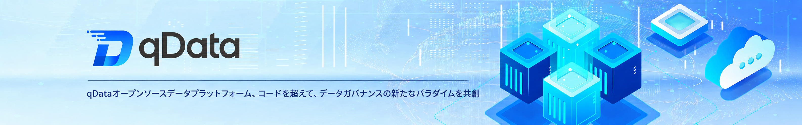

  
 
 
 
 

 
 
 

  <a href="README.zh-CN.md">📖简体中文</a> | <a href="README.md">📖English</a> | 📖日本語

## 🌈 プラットフォーム概要
**qData データ中台**は、企業のデータガバナンスとデータ開発シナリオ向けのオープンソースデータ中台です。**ETLデータ連携、データ開発、データモデリング、メタデータ管理、データ品質、データ資産、APIデータサービス、AIデータ問答**などの核心機能を中心に構築され、MySQL、DM8、Oracle、SQL Server、Kingbase8、Dorisなどの一般的なデータベースへの接続をサポートしています。qDataは、企業がデータアクセス、クレンジング・変換、資産カタログ、品質検査、API公開、Text2SQL分析を迅速に完了できるよう支援します。企業のデータ中台、データガバナンスプラットフォーム、ETLプラットフォーム、データサービスプラットフォームを構築するオープンソース基盤として活用でき、開発者の二次開発と機能拡張もサポートしています。

✨✨✨**オンラインドキュメント**✨✨✨ <a href="https://community.qdata.tech" target="_blank">https://community.qdata.tech</a>

✨✨✨**オープンソース版デモ**✨✨✨ <a href="https://demo.qdata.tech" target="_blank">https://demo.qdata.tech</a>、アカウント：qData、パスワード：qData123

✨✨✨**プロフェッショナル版デモ**✨✨✨ <a href="https://pro-demo.qdata.tech" target="_blank">https://pro-demo.qdata.tech</a>。デモアカウントの取得は[カスタマーサービスにお問い合わせ](https://community.qdata.tech/business/policy.html)ください。

> qDataがお役に立ちましたら、**Star ⭐️**をいただけますと幸いです。それが私たちが継続的に改善する最大の原動力となります！ 🚀

## 🍱 利用シナリオ

qDataオープンソース版は、企業、政府機関、研究機関・大学、開発チームがデータ中台、ETLデータ連携、データガバナンス、データ資産管理、データサービス能力を構築するのに適しています。データガバナンスプラットフォームやデータ開発プラットフォームの二次開発基盤としても利用できます。

| シナリオ | 説明 | 典型的な顧客タイプ |
| --- | --- | --- |
| **ETLデータ連携** | データアクセス、クレンジング、変換、出力のワークフローを可視的に設定し、ビジネスデータの集約と処理をサポート。 | データ開発チーム、ソフトウェア企業 |
| **データガバナンス構築** | データ標準、データモデル、メタデータ、データ品質、データ資産を統合管理し、基礎ガバナンス体系を構築。 | 政府機関、グループ企業、研究機関・大学 |
| **データ資産管理** | データテーブル、フィールド、タグ、カテゴリなどの資産を統合カタログ化し、データの発見と再利用効率を向上。 | データ管理部門、公共サービス機構 |
| **APIデータサービス** | データテーブルやSQLクエリ結果をAPIサービスとしてカプセル化し、データインターフェースの公開とシステム連携をサポート。 | プラットフォーム開発チーム、統合サービスプロバイダー |
| **AIデータ問答分析** | 自然言語データ質問、Text2SQLクエリ、結果分析をサポートし、ビジネスユーザーのデータ利用の敷居を下げる。 | ビジネス分析チーム、運用チーム |
| **二次開発基盤** | オープンソース基盤に基づいてデータ連携、データガバナンス、データサービス機能を拡張し、ゼロからの開発コストを低減。 | 開発者、ISVベンダー、プロジェクト納品チーム |

## 💡 特長

| 特長 | 説明 |
| --- | --- |
| **オープンソース・拡張可能** | オープンソースデータ中台の基礎機能を提供し、企業、開発者、プロジェクトチームがビジネスニーズに応じてカスタマイズ・拡張可能。 |
| **可視化ETL** | データアクセス、クレンジング、変換、出力のワークフローを可視的に設定可能、データ連携タスクの開発敷居を下げる。 |
| **包括的なガバナンス機能** | データ標準、データモデリング、メタデータ管理、データ品質、データ資産などの核心ガバナンス機能をカバーし、企業の基礎データガバナンス体系構築を支援。 |
| **多源データアクセス** | オープンソース版はMySQL、Oracle、DM8などの一般的なデータベースへの接続をサポートし、一般的なビジネスシステムのデータ管理要件を満たす。 |
| **オープンデータサービス** | データテーブルやSQLクエリ結果をAPIサービスとしてカプセル化し、オンラインテスト、呼び出しログ、アプリケーション管理機能を提供。 |
| **AIデータ問答** | 自然言語データ質問、Text2SQL、インテリジェントチャート分析をサポートし、ビジネスユーザーのデータ照会・分析の敷居を下げる。 |
| **軽量・容易なデプロイ** | 迅速なデプロイ、検証、試用に適し、企業データ中台、ETLプラットフォーム、データガバナンスプラットフォームのオープンソース基盤として活用可能。 |
| **プロフェッショナル版へのスムーズな移行** | オープンソース版は初期検証と基礎シナリオに利用可能。複雑なデータガバナンス、全DB同期、マスターデータ、データセキュリティ、BI可視化などのニーズにはプロフェッショナル版へのアップグレードが可能。 |

## ✅ 現在の機能

| モジュール | 説明 |
| --- | --- |
| **データ連携（ETL）** | データアクセス、クレンジング、変換、出力のワークフローを可視的に設定可能、一般的なビジネスデータの集約、加工、同期シナリオに適用。 |
| **データ開発** | SQLスクリプト方式でのデータ処理タスク開発をサポート、データ加工、統計分析、定期処理などのシナリオに適用。 |
| **データモデリング** | データ標準、データウェアハウス層別化、データ分域、主題計画、論理モデル、標準データ要素などの機能をサポートし、企業の基礎データモデル体系構築を支援。 |
| **メタデータ管理** | メタデータ閲覧、フィールド構造閲覧、バージョン管理、メタデータ比較をサポートし、テーブル構造、フィールド情報、バージョン変化の把握を容易にする。 |
| **データ品質** | 稽査ルールに基づくデータ品質検査と処理をサポートし、完全性、一意性、有効性などの問題を発見可能。 |
| **データ資産** | データ資産カタログ、資産タグ、資産詳細、資産検索などの機能をサポートし、ユーザーがデータ資源を統合管理・検索できるよう支援。 |
| **データ照会** | データソースに対するオンラインSQLクエリをサポートし、一時照会、データ検証、結果エクスポートに活用可能。 |
| **データサービス** | データテーブルやSQLクエリ結果をAPIサービスとしてカプセル化し、オンラインテスト、呼び出しログ、アプリケーション管理機能を提供。 |
| **AIデータ問答** | 自然言語データ質問、Text2SQL、インテリジェントチャート、結果詳細閲覧をサポートし、ビジネスユーザーのデータ利用の敷居を下げる。 |
| **基本管理** | データソース、プロジェクトスペース、カテゴリ、稽査ルール、クレンジングルールなどの基本設定をサポートし、データ開発とデータガバナンスを支える。 |
| **システム管理** | ユーザー、ロール、メニュー、部門、職位、辞書、パラメータ、公告、ログなどの基本システム管理機能をサポート。 |

👉 qDataデータ中台はモジュール設計を採用しています。現在のオープンソース版はデータ連携、データ開発、データモデリング、メタデータ、データ品質、データ資産、データサービス、AIデータ問答などの核心機能に注力しています。詳細は：[qData機能一覧](https://community.qdata.tech/docs/start/features.html)

## 🚧今後の開発計画

| 機能 | 説明 |
| --- | --- |
| **メタデータ収集タスク** | データソースごとにメタデータ収集タスクを設定する機能を計画。収集範囲、収集対象、実行戦略を設定可能、テーブル、フィールドなどのメタデータ情報を自動収集。 |
| **メタデータ収集インスタンス** | 各メタデータ収集の実行インスタンスを記録する機能を計画。実行状態、実行時間、収集結果、ログ情報を表示し、収集過程を追跡可能にする。 |
| **最新メタデータ** | 最新収集メタデータの表示を計画。テーブル構造、フィールド情報、データ型、フィールド説明などを含み、データ構造の現状確認に便利。 |
| **バージョン固定メタデータ** | メタデータをバージョンで固定管理する機能を計画。重要時点のデータ構造状態を記録し、バージョン追跡と変更検査をサポート。 |
| **メタデータ比較** | バージョン間のメタデータ構造差異比較を計画。フィールドの追加、削除、型変更、説明変更などの識別を支援。 |
| **ビジネス層別化** | データウェアハウス計画向けのビジネス層別化機能の強化を計画。ビジネスシナリオ、データ領域、主題に沿ったモデルの組織・管理をより明確にサポート。 |
| **モデル公開** | 論理モデルを物理モデルやデータテーブル構造として公開する機能を計画。モデル設計から実利用までの流れを接続。 |
| **データ資産再構築** | データ資産モジュールの再構築を計画。資産カタログ、資産詳細、資産検索、資産タグ、資産保守体験を最適化。 |
| **データ連携強化** | ETLコンポーネント、変換演算子、データソースタイプを継続的に拡張し、複雑なデータアクセス、クレンジング、変換、出力タスクの設定能力を向上。 |
| **データ品質強化** | 稽査ルール、クレンジングルール、品質レポート機能を継続的に拡張し、データ品質問題の発見、分析、処理効率を向上。 |
| **データサービス強化** | APIサービス公開、インターフェーステスト、呼び出しログ、アプリケーション認証、レート制限機能を最適化し、データサービス公開体験を向上。 |
| **AI機能強化** | Text2SQL、インテリジェントチャート、問答結果解説、データインサイト機能を継続的に最適化し、自然言語分析体験を向上。 |

💡 ご提案や機能要求がありましたら、[Issueを提出](https://gitee.com/qiantongtech/qData/issues)ください。qDataデータ中台を共同で改善しましょう。

[//]: # (## 🧩 アーキテクチャ図)

[//]: # (![framework.png]&#40;images%2Fframework.png&#41;)

## 🛠️ 技術スタック
qDataはフロントエンド・バックエンド分離アーキテクチャを採用しています。バックエンドはSpring Boot、フロントエンドはVue 3に基づき、主流のミドルウェアとデータツールを統合しています。

<table>
  <tr>
    <th>カテゴリ</th><th>技術</th><th>説明</th>
  </tr>
  <tr>
    <td rowspan="6">バックエンド技術スタック</td><td>Spring Boot</td><td>高速開発機能を提供</td>
  </tr>
  <tr>
    <td>Spring Security</td><td>ユーザー認証と権限管理を実装</td>
  </tr>
  <tr>
    <td>MySQL、PostgreSQL、DM8、KingbaseES</td><td>永続ストレージと設定管理</td>
  </tr>
  <tr>
    <td>MyBatis-Plus</td><td>データベース操作を簡素化</td>
  </tr>
  <tr>
    <td>Redis</td><td>キャッシュ、分散ロックなどをサポート</td>
  </tr>
  <tr>
    <td>RabbitMQ</td><td>非同期通信とデカップリング処理を実現</td>
  </tr>

  <tr>
    <td rowspan="3">フロントエンド技術スタック</td><td>Vue 3</td><td>モダンなリアクティブフレームワーク</td>
  </tr>
  <tr>
    <td>Element UI</td><td>一般的なUIコンポーネントサポート</td>
  </tr>
  <tr>
    <td>Vite</td><td>高速開発とビルドツール</td>
  </tr>

  <tr>
    <td rowspan="4">サードパーティ依存</td><td>DolphinScheduler</td><td>可視的タスクオーケストレーション、依存管理、スケジューリング機能を提供</td>
  </tr>
  <tr>
    <td>Spark</td><td>バッチ・ストリーミング統合処理、ETLデータ処理をサポート</td>
  </tr>
  <tr>
    <td>Hive</td><td>データモデリング、パーティション管理、メタデータ保守をサポート</td>
  </tr>
  <tr>
    <td>Hive、HBase</td><td>大規模な非構造化および半構造化データストレージをサポート</td>
  </tr>
</table>

## 🏗️ デプロイ要件

qDataをデプロイする前に、以下の環境とツールが正しくインストールされていることを確認してください：

<table>
  <tr>
    <th>環境</th><th>項目</th><th>推奨バージョン</th><th>説明</th>
  </tr>
  <tr>
    <td rowspan="6">バックエンド</td><td>JDK</td><td>1.8以上</td><td>OpenJDK 8または11を推奨</td>
  </tr>
  <tr>
    <td>Maven</td><td>3.6+</td><td>プロジェクトビルドと依存管理</td>
  </tr>
  <tr>
    <td>DM8</td><td>8.0</td><td>リレーショナルデータベース（MySQLに切替可能）</td>
  </tr>
  <tr>
    <td>Redis</td><td>5.0+</td><td>キャッシュとメッセージ機能をサポート</td>
  </tr>
  <tr>
    <td>RabbitMQ</td><td>オプション</td><td>タスクスケジューリング、非同期通信などの機能に使用</td>
  </tr>
  <tr>
    <td>オペレーティングシステム</td><td>Windows / Linux / Mac</td><td>一般的な環境がサポートされています</td>
  </tr>

  <tr>
    <td rowspan="3">フロントエンド</td><td>Node.js</td><td>16+</td><td>ビルドツール依存</td>
  </tr>
  <tr>
    <td>npm</td><td>10+</td><td>パッケージマネージャ</td>
  </tr>
  <tr>
    <td>Vite</td><td>最新版</td><td>スキャフォールドとビルドツール</td>
  </tr>
</table>

## 🚨 商用ライセンス

qDataは**プロフェッショナル版**と**オープンソース版**の2つのエディションを提供し、異なる規模とシナリオでのユーザーニーズを満たします。両者はそれぞれ特色を持ちながら互补関係を形成しています：オープンソース版は低コストでのスタートを支援し、プロフェッショナル版は深さと保障を提供します。どちらのエディションを選択しても、qDataは信頼できるパートナーとなり、企業のデータ価値の解放とデジタル変革の加速を支援します。

👉 **オープンソース版ブランド認証**や**プロフェッショナル版のご相談**は、詳細をご覧ください：[💼 ライセンス詳細](https://community.qdata.tech/business/policy.html)

## 🚀 クイックスタート

| デプロイ方式 | 説明 | 適用シナリオ |
| --- | --- | --- |
| [Docker Composeデプロイ](https://community.qdata.tech/docs/deploy/docker-compose-deployment.html) | 全コンポーネント（スケジューラ、データベース、メッセージキュー、Spark、Flinkなど）およびqDataソースコードがDocker Composeで一括起動 | **初心者のクイックスタート**、機能デモ、テスト環境 |
| [ソースコードからローカル起動](https://community.qdata.tech/docs/deploy/build-from-source.html) | 開発者がqDataソースコードをローカルで実行、依存コンポーネントはDocker Composeで起動 | **日常開発**、機能連携テスト |
| [自律デプロイ（手動インストール）](https://community.qdata.tech/docs/deploy/manual-deployment/) | 全依存コンポーネントとqDataサービスを手動でインストール・設定 | **本番環境**、大規模デプロイ、カスタマイズシナリオ |

👉 完全なインストールとデプロイガイド：<a href="https://community.qdata.tech/docs/deploy/deploy-open-source.html">🧭 詳細デプロイ手順を確認</a>

## 👥 QQコミュニティ
qData公式QQコミュニティに参加して、最新情報、技術サポート、利用交流を入手してください。

👉 <a href="https://community.qdata.tech/discuss.html">QQコミュニティに参加</a>

<!-- 

 -->

## 🖼️ システム画面
<table>
    <tr>
        <td>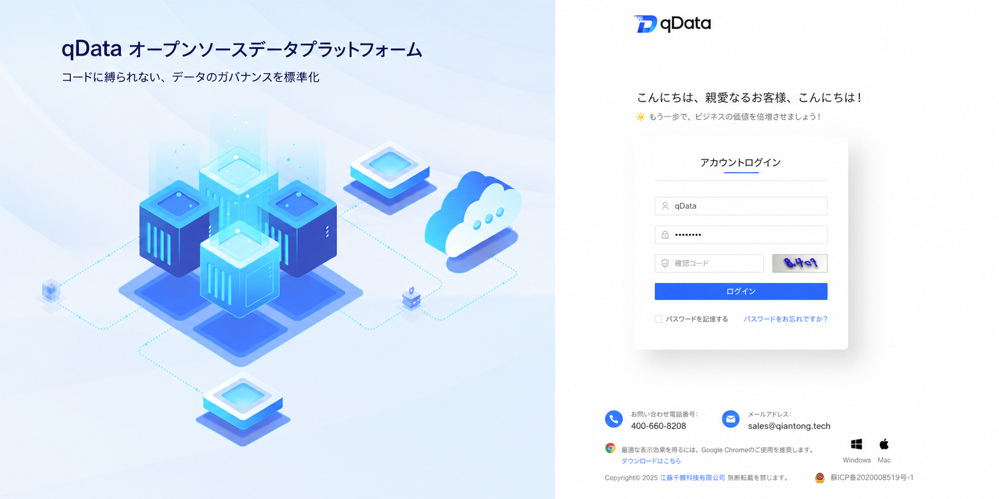</td>
        <td>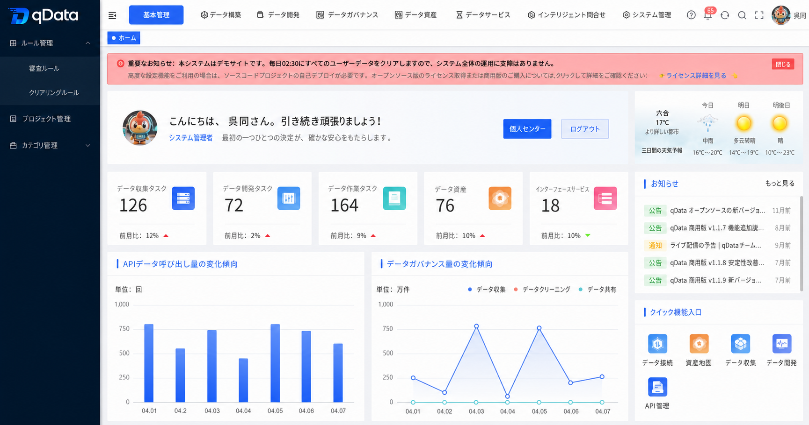</td>
    </tr>
    <tr>
        <td>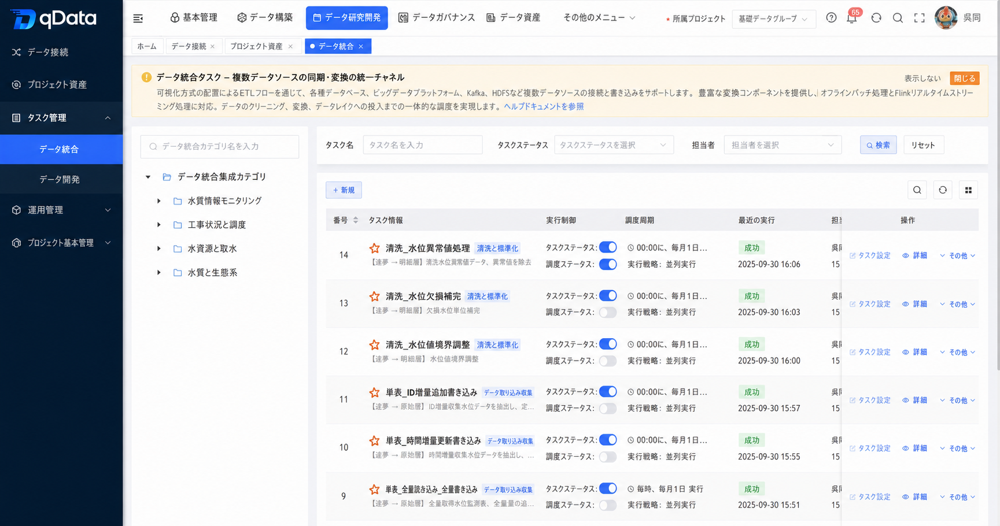</td>
        <td>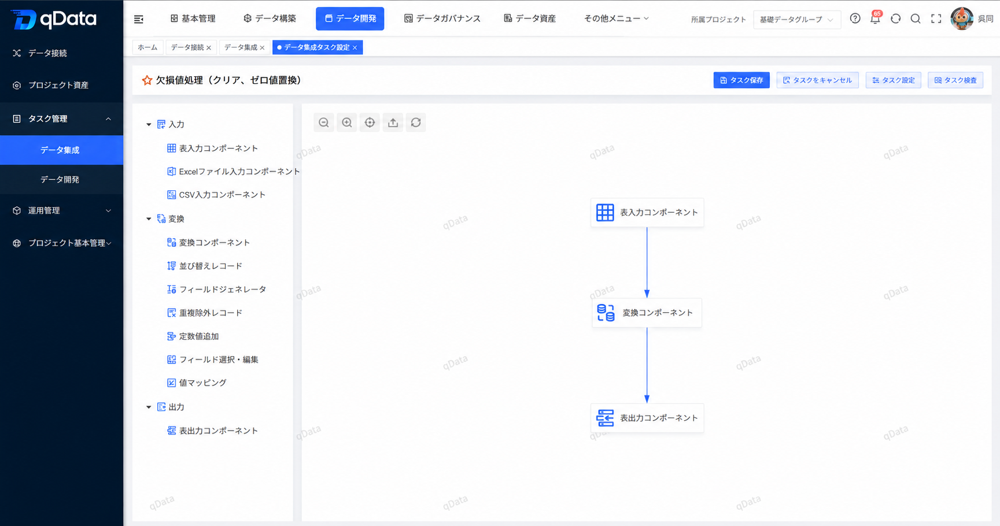</td>
    </tr>
    <tr>
        <td>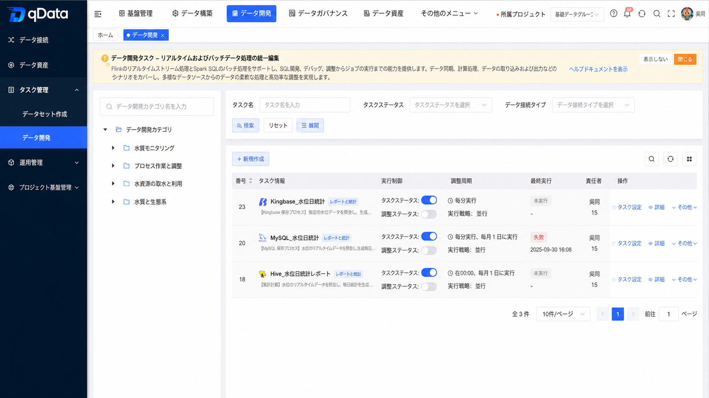</td>
        <td>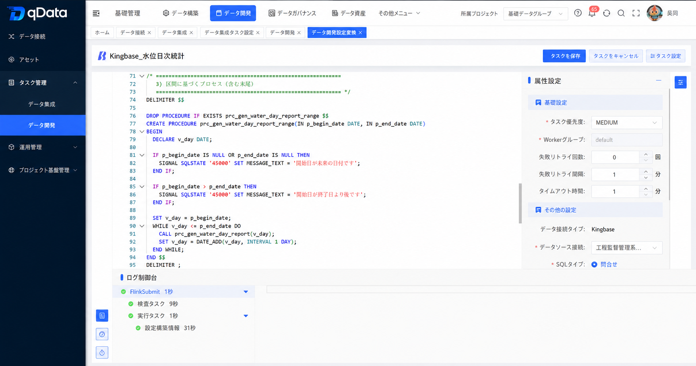</td>
    </tr>
    <tr>
        <td>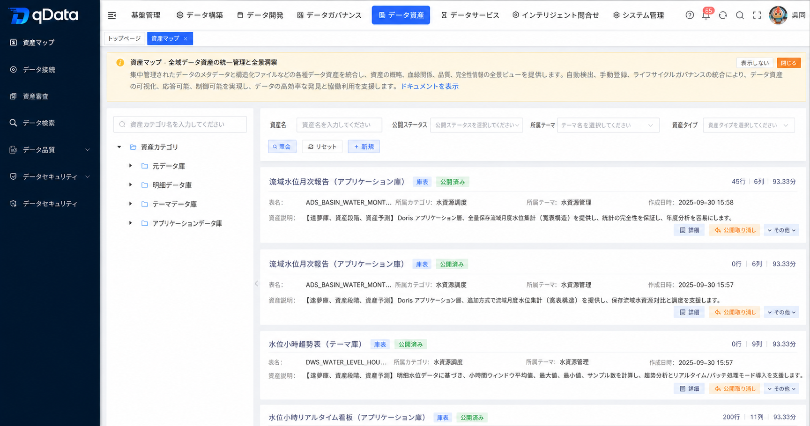</td>
        <td>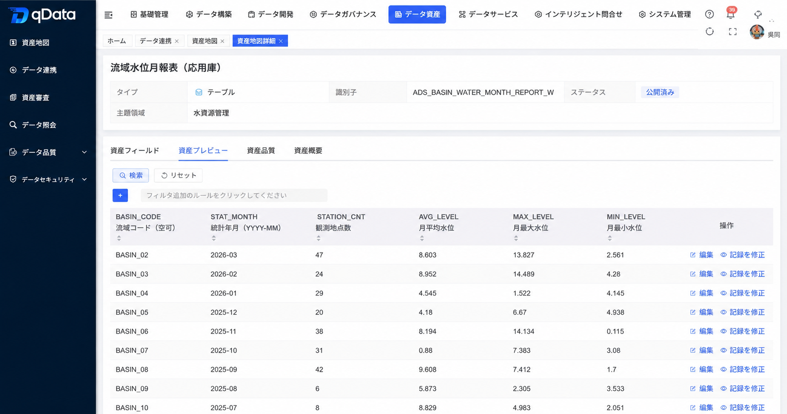</td>
    </tr>
    <tr>
        <td>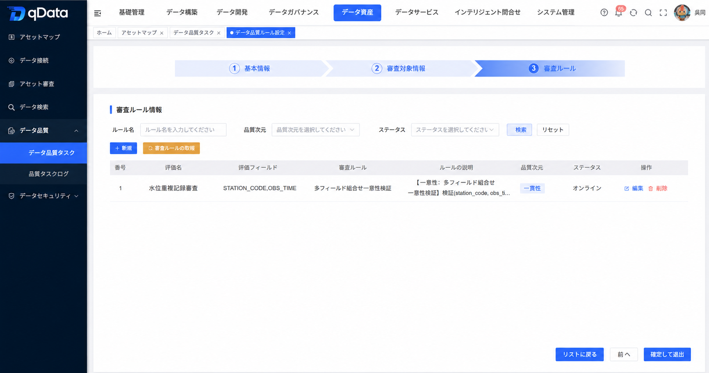</td>
        <td>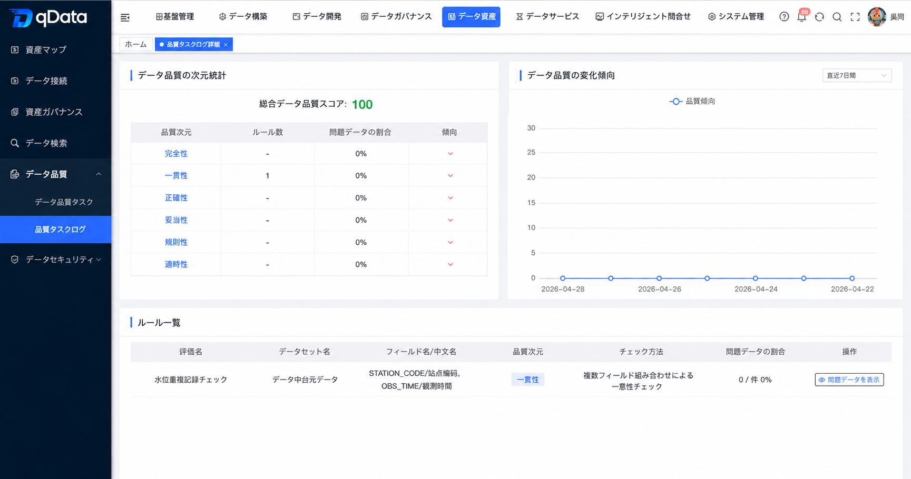</td>
    </tr>
    <tr>
        <td>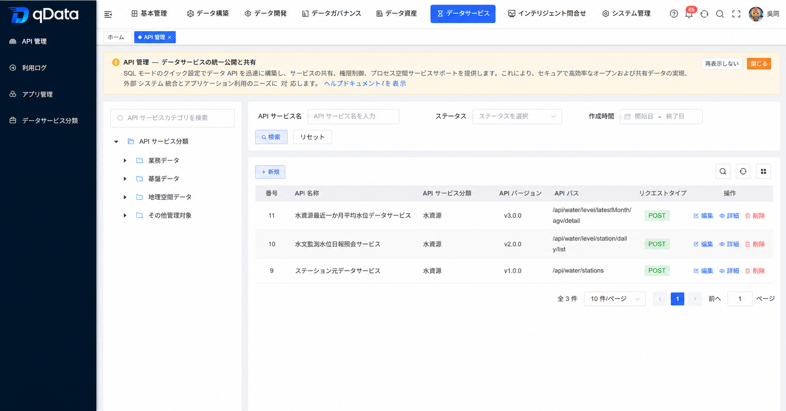</td>
        <td>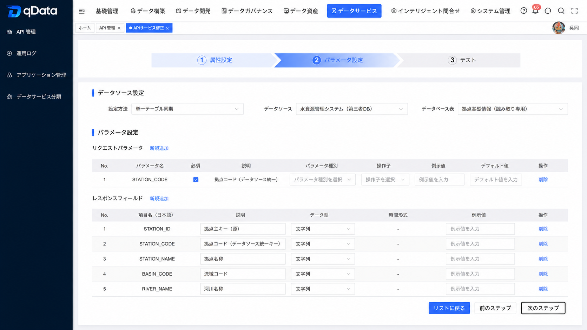</td>
    </tr>
    <tr>
        <td>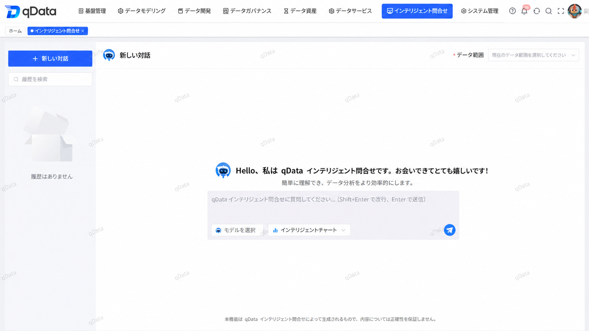</td>
        <td>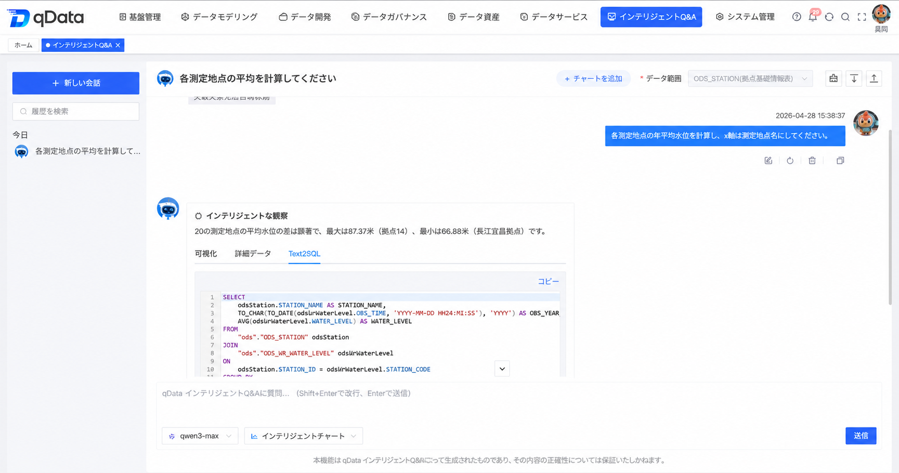</td>
    </tr>
</table>
