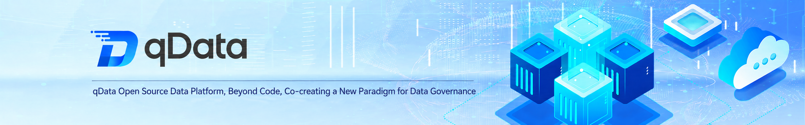

  
 
 
 
 

 
 
 

  <a href="README.zh-CN.md">📖简体中文</a> | 📖English | <a href="README.ja-JP.md">📖日本語</a>

## 🌈 Platform Overview
**qData Data Middle Platform** is an open-source data middle platform designed for enterprise data governance and data development scenarios. Built around core capabilities such as **ETL data integration, data development, data modeling, metadata management, data quality, data assets, API data services, and AI-powered data Q&A**, it supports common databases including MySQL, DM8, Oracle, SQL Server, Kingbase8, and Doris. qData helps enterprises quickly complete data access, cleansing and transformation, asset cataloging, quality checks, API publishing, and Text2SQL analysis. It can serve as an open-source foundation for building enterprise data middle platforms, data governance platforms, ETL platforms, and data service platforms, and is also suitable for secondary development and feature extensions.

✨✨✨**Online Documentation**✨✨✨ <a href="https://community.qdata.tech" target="_blank">https://community.qdata.tech</a>

✨✨✨**Open-Source Edition Demo**✨✨✨ <a href="https://demo.qdata.tech" target="_blank">https://demo.qdata.tech</a>, username: qData, password: qData123

✨✨✨**Professional Edition Demo**✨✨✨ <a href="https://pro-demo.qdata.tech" target="_blank">https://pro-demo.qdata.tech</a>. Please [contact customer service](https://community.qdata.tech/business/policy.html) to obtain a demo account.

> If qData is helpful to you, please give us a **Star ⭐️**. It is the greatest motivation for us to keep improving! 🚀

## ✅ Feature List

> 👉 qData Data Middle Platform uses a modular design. The current open-source edition focuses on core capabilities including data integration, data development, data modeling, metadata, data quality, data assets, data services, and AI-powered data Q&A. For more details, see the [qData Feature Overview](https://community.qdata.tech/business/pro/features.html).

| Module | Description |
| --- | --- |
| **Data Integration (ETL)** | Supports visual configuration of data ingestion, cleansing, transformation, and output workflows. New tasks can use either DataX or Spark as the execution engine, making them suitable for lightweight data synchronization, related-data retrieval, data import, large-scale offline processing, and complex computing scenarios. |
| **Data Development** | Supports data processing task development through SQL scripts. New tasks can choose Quartz or DolphinScheduler schedulers, suitable for data processing, statistical analysis, periodic scheduling, and task orchestration scenarios. |
| **Data Modeling** | Supports data standards, data warehouse layers, data domains, subject-area planning, logical models, standard data elements, and other capabilities to help enterprises establish a foundational data modeling framework. |
| **Metadata Management** | Supports metadata viewing, field structure viewing, version management, metadata comparison, and metadata collection task management. New collection tasks can choose Quartz or DolphinScheduler schedulers, making collection execution strategies more flexible. |
| **Data Quality** | Supports data quality inspection and processing based on audit rules, helping identify issues such as completeness, uniqueness, and validity. |
| **Data Assets** | Supports data asset cataloging, asset tags, asset details, asset search, and other capabilities to help users manage and retrieve data resources in a unified way. |
| **Data Query** | Supports online SQL queries against data sources for temporary queries, data validation, and result export. |
| **Data Services** | Supports encapsulating data tables or SQL query results as API services, with online testing, call logs, and application management capabilities. |
| **AI-Powered Data Q&A** | Supports natural-language data questions, Text2SQL, intelligent charts, and result detail viewing, lowering the barrier for business users to work with data. |
| **Basic Management** | Supports data sources, project workspaces, categories, audit rules, cleansing rules, and other basic configurations to support data development and data governance. |
| **System Management** | Supports users, roles, menus, departments, positions, dictionaries, parameters, announcements, logs, and other basic system management capabilities. |

## 🚧 Future Roadmap

Future development will focus on **metadata comparison, business layering, and data asset refactoring** to further improve the data governance and asset management experience. We will also continue enhancing **data integration, data quality, data services, and AI capabilities**, expanding data sources and ETL components, and optimizing quality rules, API services, and the Text2SQL analysis experience.

> 💡 If you have suggestions or feature requests, please [submit an Issue](https://gitee.com/qiantongtech/qData/issues) and help us improve qData Data Middle Platform.

## 🛠️ Technology Stack
qData adopts a frontend-backend separated architecture. The backend is based on Spring Boot, the frontend is based on Vue 3, and the platform integrates several mainstream middleware and data tools.

<table>
  <tr>
    <th>Category</th><th>Technology</th><th>Description</th>
  </tr>
  <tr>
    <td rowspan="6">Backend Technology Stack</td><td>Spring Boot</td><td>Provides rapid development capabilities</td>
  </tr>
  <tr>
    <td>Spring Security</td><td>Implements user authentication and permission control</td>
  </tr>
  <tr>
    <td>MySQL, PostgreSQL, DM8, KingbaseES</td><td>Persistent storage and configuration management</td>
  </tr>
  <tr>
    <td>MyBatis-Plus</td><td>Simplifies database operations</td>
  </tr>
  <tr>
    <td>Redis</td><td>Supports caching, distributed locks, and more</td>
  </tr>
  <tr>
    <td>RabbitMQ</td><td>Enables asynchronous communication and decoupled processing</td>
  </tr>

  <tr>
    <td rowspan="3">Frontend Technology Stack</td><td>Vue 3</td><td>Modern reactive framework</td>
  </tr>
  <tr>
    <td>Element UI</td><td>Common UI component support</td>
  </tr>
  <tr>
    <td>Vite</td><td>Fast development and build tool</td>
  </tr>

  <tr>
    <td rowspan="4">Third-Party Dependencies</td><td>DolphinScheduler</td><td>Provides visual task orchestration, dependency management, and scheduling capabilities, and can be used to schedule data development and collection tasks</td>
  </tr>
  <tr>
    <td>Quartz</td><td>Provides lightweight task scheduling capabilities, can be used for data development task and metadata collection task scheduling, and is suitable for single-node deployment and simple periodic task scenarios</td>
  </tr>
  <tr>
    <td>DataX</td><td>Lightweight data synchronization execution engine that runs on a single node, is simple to deploy, and is suitable for related data acquisition and data import scenarios</td>
  </tr>
  <tr>
    <td>Spark</td><td>Distributed computing execution engine suitable for large-scale offline processing and complex computing tasks</td>
  </tr>
</table>

## 🚨 Commercial Licensing

qData provides two editions: **Professional Edition** and **Open-Source Edition**, meeting user needs across different scales and scenarios. Each has its own focus while complementing the other: the Open-Source Edition helps users get started at low cost, while the Professional Edition provides greater depth and support. Whichever edition you choose, qData aims to be a reliable partner that helps enterprises unlock data value and accelerate digital transformation.

> 👉 For **Open-Source Edition brand authorization** or **Professional Edition consultation**, see [💼 Licensing Details](https://community.qdata.tech/business/policy.html).

## 🚀 Quick Start
If this is your first time using qData, we recommend exploring it in the following order:

1. **Online demo**: Sign in to the demo environment to explore the main features without installing anything.
2. **Local deployment**: Start the complete environment locally with Docker Compose.
3. **Run from source**: Start the frontend and backend services from source when you need to customize or extend qData.

### 1. Online Demo

- Sign in to the [Community Open-Source Edition demo](#-platform-overview) to explore the main features without installing anything.

### 2. Choose a Deployment Method

- [Local deployment](https://community.qdata.tech/docs/deploy/docker-compose-deployment.html): Start the complete environment locally with Docker Compose.
- [Run from source](https://community.qdata.tech/docs/deploy/build-from-source.html): Start the frontend and backend services from source when you need to customize or extend qData.
- [Self-managed deployment](https://community.qdata.tech/docs/deploy/manual-deployment/): Manually install, configure, and manage each service; suitable for production environments, large-scale deployments, and custom configurations.

> 👉 Complete guide: https://community.qdata.tech/docs/deploy/deploy-open-source.html

## 🏗️ Deployment Requirements

Before deploying qData, make sure the following environments and tools are correctly installed:

<table>
  <tr>
    <th>Environment</th><th>Item</th><th>Recommended Version</th><th>Description</th>
  </tr>
  <tr>
    <td rowspan="6">Backend</td><td>JDK</td><td>1.8 or above</td><td>OpenJDK 8 or 11 is recommended</td>
  </tr>
  <tr>
    <td>Maven</td><td>3.6+</td><td>Project build and dependency management</td>
  </tr>
  <tr>
    <td>DM8</td><td>8.0</td><td>Relational database (can be switched to MySQL)</td>
  </tr>
  <tr>
    <td>Redis</td><td>5.0+</td><td>Supports caching and messaging</td>
  </tr>
  <tr>
    <td>RabbitMQ</td><td>Optional</td><td>Used for task scheduling, asynchronous communication, and other features</td>
  </tr>
  <tr>
    <td>Operating System</td><td>Windows / Linux / Mac</td><td>Runs in all common environments</td>
  </tr>

  <tr>
    <td rowspan="3">Frontend</td><td>Node.js</td><td>16+</td><td>Build tool dependency</td>
  </tr>
  <tr>
    <td>npm</td><td>10+</td><td>Package manager</td>
  </tr>
  <tr>
    <td>Vite</td><td>Latest</td><td>Scaffolding tool</td>
  </tr>
</table>

## 👥 QQ Community
Welcome to join the official qData QQ community to get the latest updates, technical support, and usage discussions.

> 👉 <a href="https://community.qdata.tech/discuss.html">Join the QQ Community</a>

<!-- 

 -->

## 🖼️ System Screenshots
<table>
    <tr>
        <td>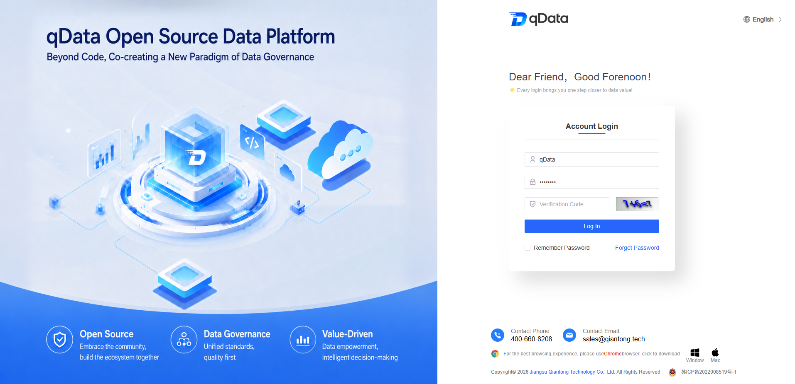</td>
        <td>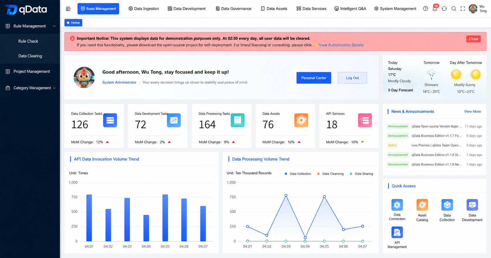</td>
    </tr>
    <tr>
        <td>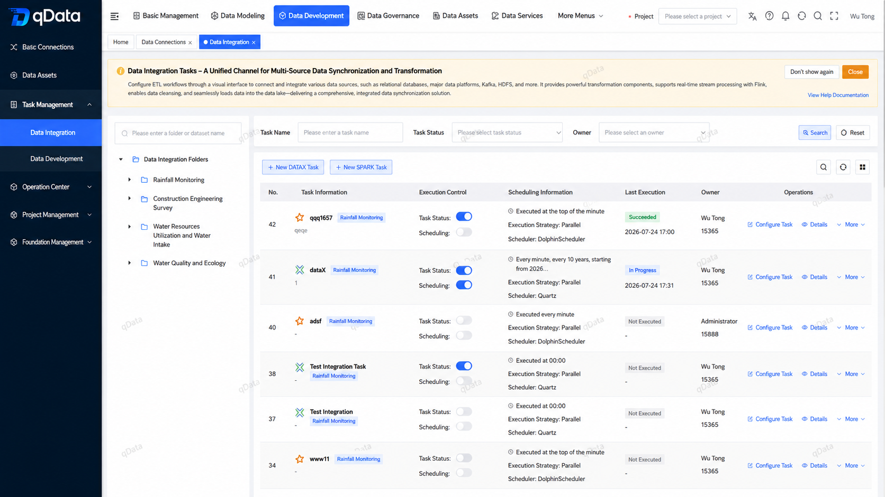</td>
        <td>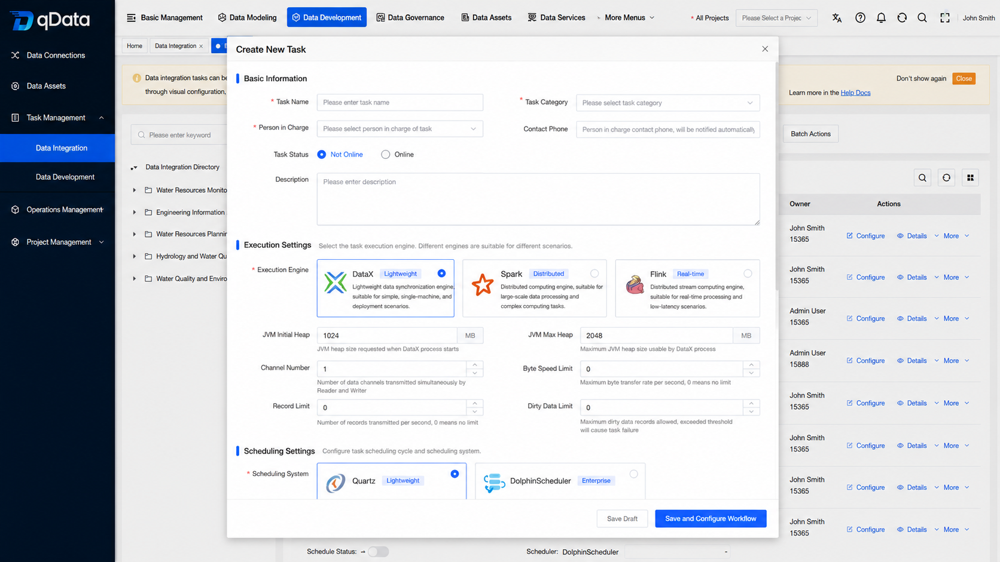</td>
    </tr>
    <tr>
        <td>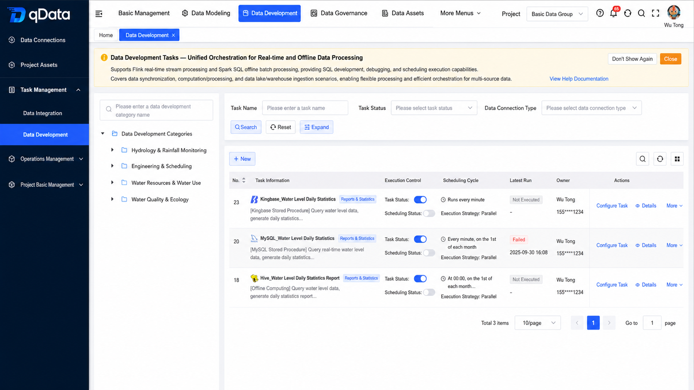</td>
        <td>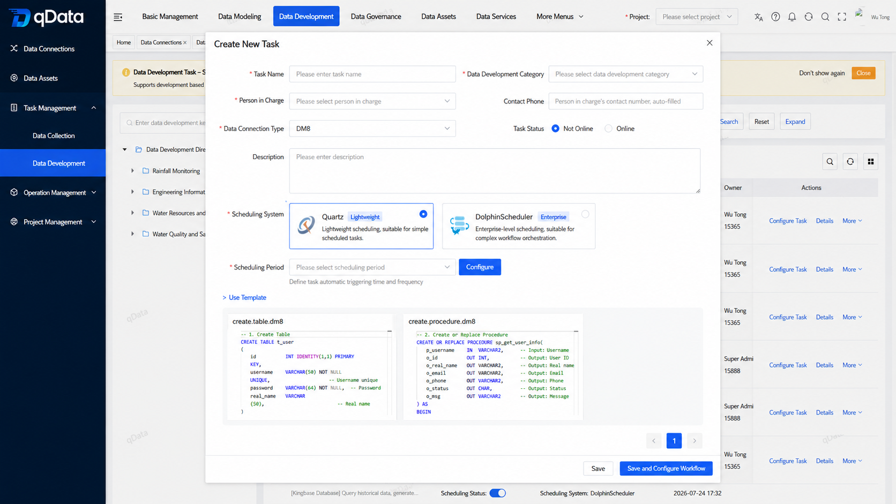</td>
    </tr>
    <tr>
        <td>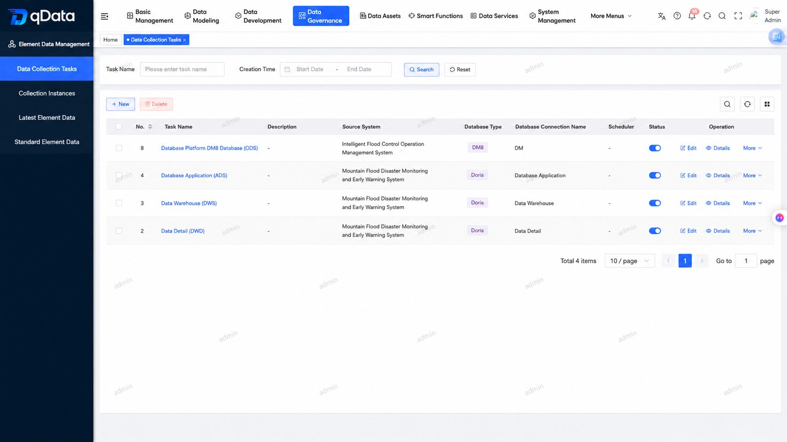</td>
        <td>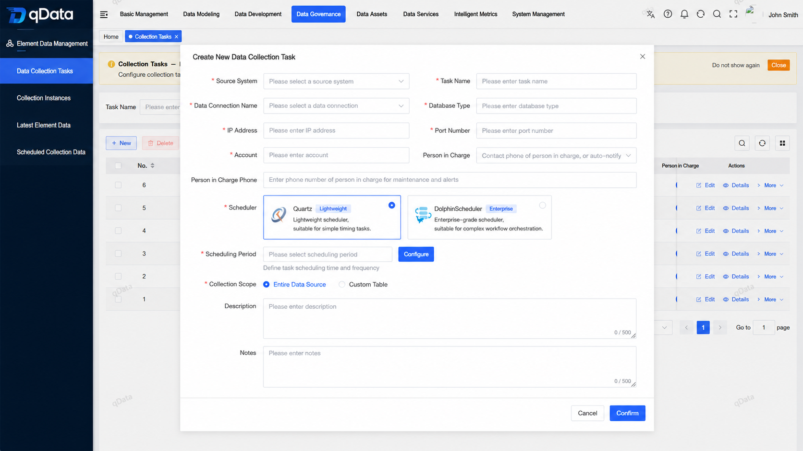</td>
    </tr>
    <tr>
        <td></td>
        <td>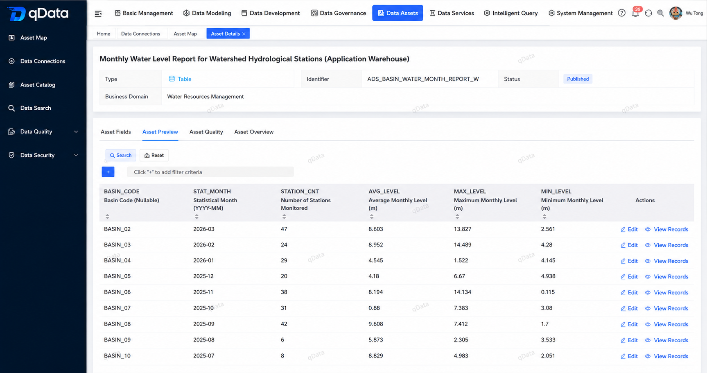</td>
    </tr>
    <tr>
        <td>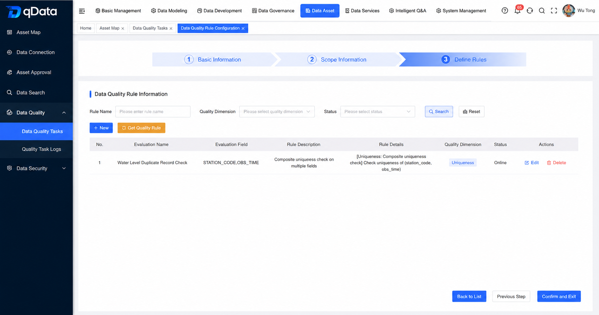</td>
        <td>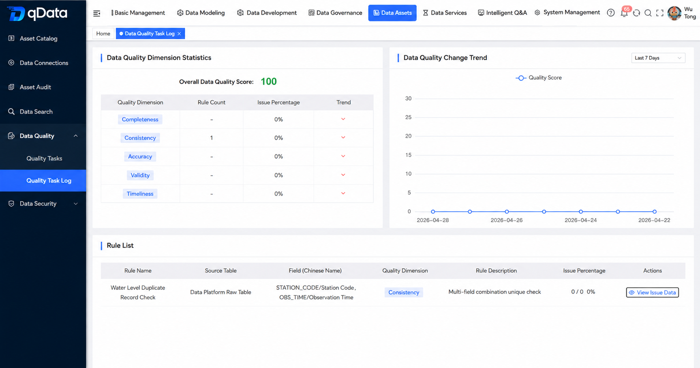</td>
    </tr>
    <tr>
        <td>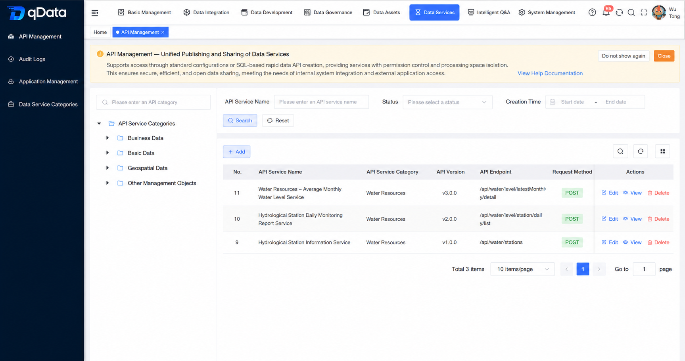</td>
        <td>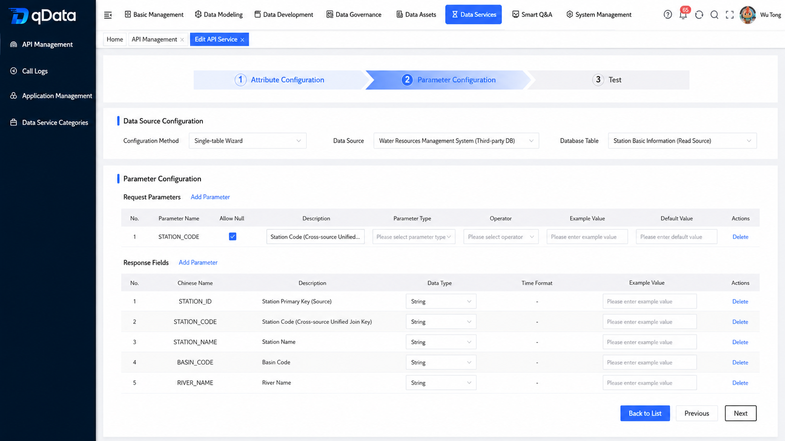</td>
    </tr>
    <tr>
        <td>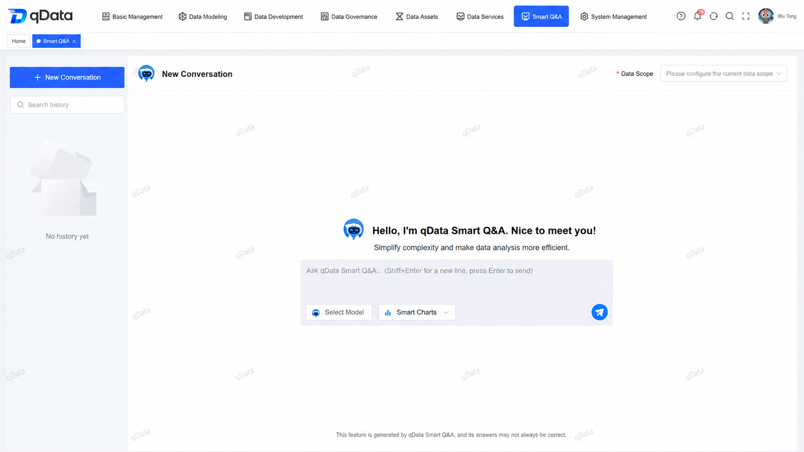</td>
        <td></td>
    </tr>
</table>
