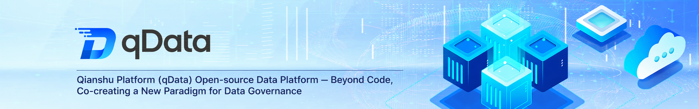
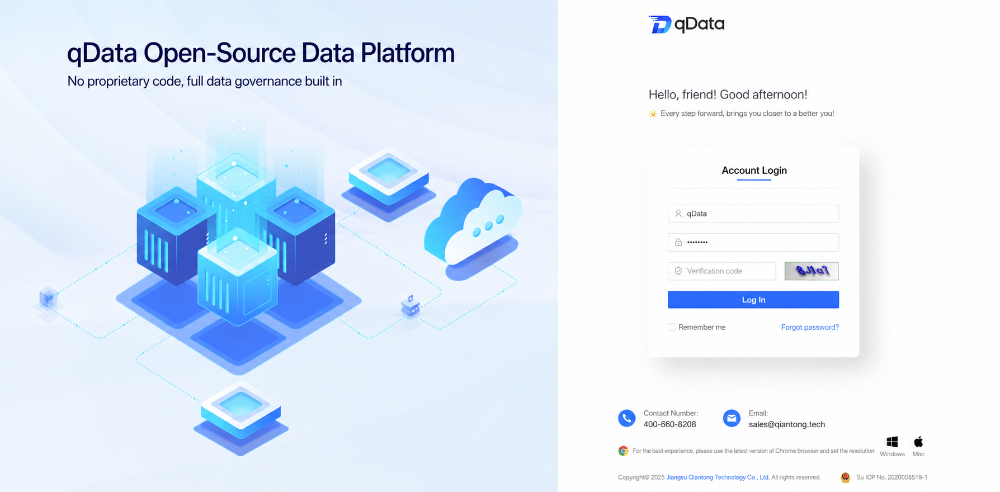
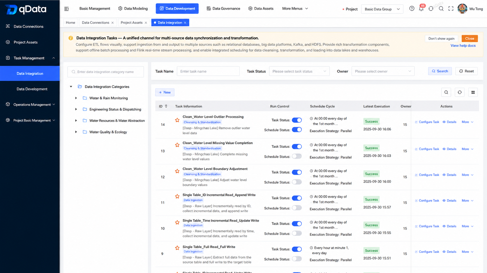
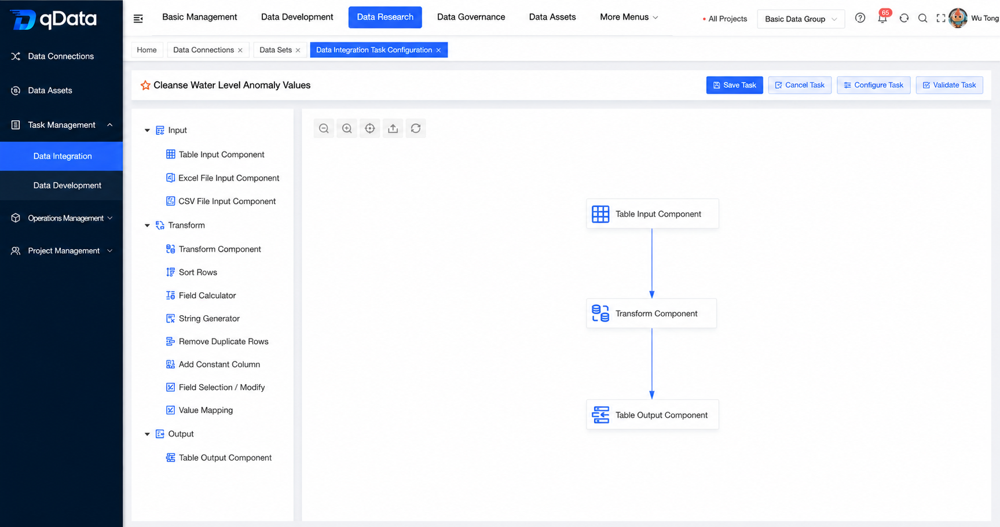
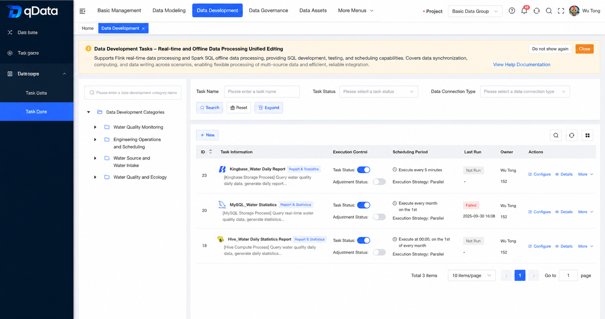
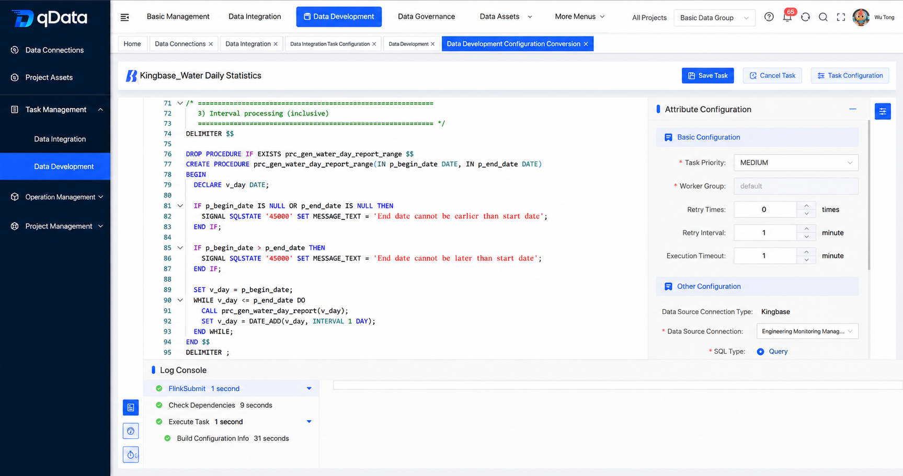
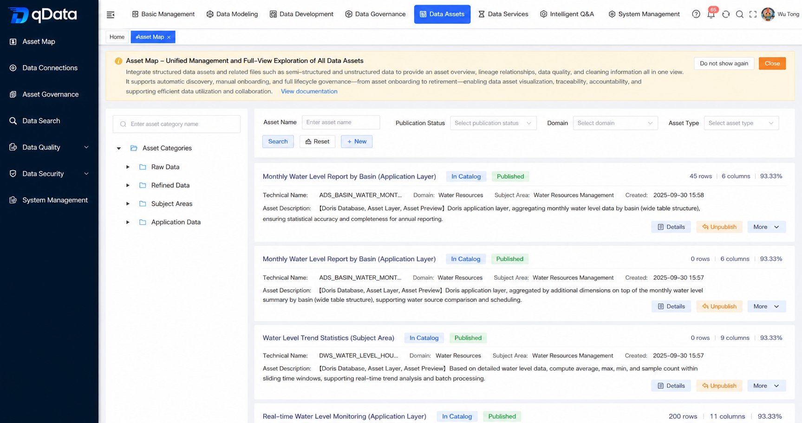
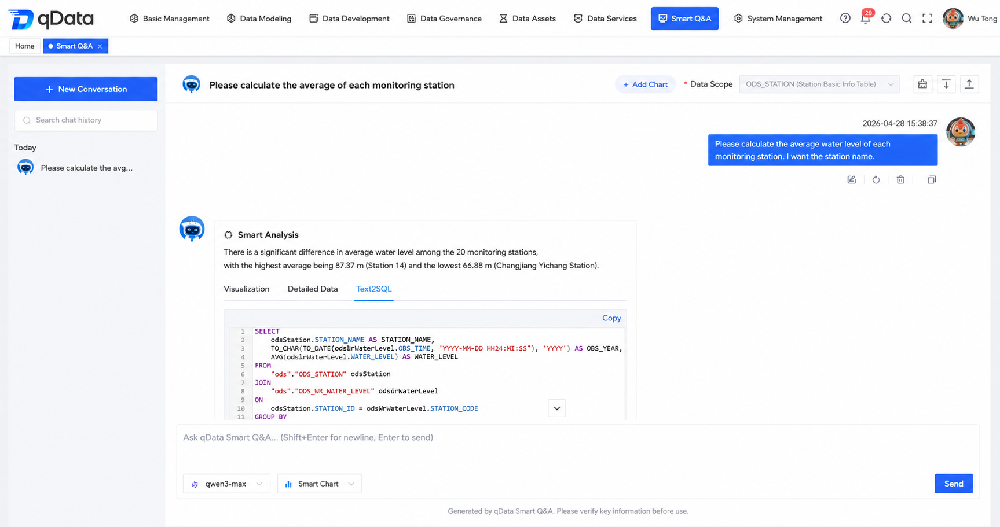

  
 
 
 
 

 
 
 

  <a href="README.zh-CN.md">📖简体中文</a> | 📖English | <a href="README.ja.md">📖日本語</a>

## 🌈 Platform Overview
**qData Data Middle Platform** is an open-source data middle platform designed for enterprise data governance and data development scenarios. Built around core capabilities such as **ETL data integration, data development, data modeling, metadata management, data quality, data assets, API data services, and AI-powered data Q&A**, it supports access to common databases including MySQL、DM8、Oracle、SQL Server、Kingbase8、Doris. qData helps enterprises quickly complete data access, cleansing and transformation, asset cataloging, quality inspection, API publishing, and Text2SQL analysis. It can serve as an open-source foundation for building enterprise data middle platforms, data governance platforms, ETL platforms, and data service platforms, while also supporting secondary development and feature extension by developers.

✨✨✨**Online Documentation**✨✨✨ <a href="https://community.qdata.tech" target="_blank">https://community.qdata.tech</a>

✨✨✨**Open-Source Demo**✨✨✨ <a href="https://demo.qdata.tech" target="_blank">https://demo.qdata.tech</a>, account: qData, password: qData123

✨✨✨**Professional Edition Demo**✨✨✨ <a href="https://pro-demo.qdata.tech" target="_blank">https://pro-demo.qdata.tech</a>. Please [contact customer service](https://community.qdata.tech/business/policy.html) to obtain a demo account.

> If qData is helpful to you, please give us a **Star ⭐️**. It is the greatest motivation for us to keep improving! 🚀

## 🍱 Use Cases

The qData open-source edition is suitable for enterprises, government agencies, research institutes, universities, and development teams building data middle platforms, ETL data integration, data governance, data asset management, and data service capabilities. It can also be used as a secondary development foundation for data governance or data development platforms.

| Scenario | Description | Typical Customer Type |
| --- | --- | --- |
| **ETL Data Integration** | Configure data access, cleansing, transformation, and output workflows visually to support business data aggregation and processing. | Data development teams, software companies |
| **Data Governance Construction** | Centrally manage data standards, data models, metadata, data quality, and data assets to establish a basic governance system. | Government agencies, group enterprises, research institutes and universities |
| **Data Asset Management** | Catalog data tables, fields, tags, categories, and other assets in a unified way to improve data discovery and reuse efficiency. | Data management departments, public service organizations |
| **API Data Services** | Encapsulate data tables or SQL query results as API services to support data interface publishing and system integration. | Platform development teams, integration service providers |
| **Intelligent Data Q&A Analysis** | Support natural-language data questions, Text2SQL queries, and result analysis to lower the barrier for business users. | Business analysis teams, operations teams |
| **Secondary Development Foundation** | Extend data integration, data governance, and data service capabilities based on the open-source foundation to reduce development costs from scratch. | Developers, ISVs, project delivery teams |

## 💡 Advantages

| Advantage | Description |
| --- | --- |
| **Open Source and Extensible** | Provides foundational open-source data middle platform capabilities, suitable for enterprises, developers, and project teams to customize and extend according to business needs. |
| **Visual ETL** | Supports visual configuration of data access, cleansing, transformation, and output workflows, lowering the development threshold for data integration tasks. |
| **Complete Governance Capabilities** | Covers core governance capabilities including data standards, data modeling, metadata management, data quality, and data assets, helping enterprises build a basic data governance system. |
| **Multi-Source Data Access** | The open-source edition supports access to common databases such as MySQL, Oracle, and DM8, meeting common business system data management requirements. |
| **Open Data Services** | Supports encapsulating data tables or SQL query results as API services, with online testing, call logs, and application management capabilities. |
| **AI-Powered Data Q&A** | Supports natural-language data questions, Text2SQL, and intelligent chart analysis, lowering the barrier for business users to query and analyze data. |
| **Lightweight and Easy to Deploy** | Suitable for quick deployment, validation, and trial use, and can serve as an open-source foundation for enterprise data middle platforms, ETL platforms, or data governance platforms. |
| **Smooth Upgrade to Professional Edition** | The open-source edition can be used for early validation and basic scenarios. For complex data governance, full-database synchronization, master data, data security, BI visualization, and other needs, users can upgrade to the Professional Edition. |

## ✅ Current Features

| Module | Description |
| --- | --- |
| **Data Integration (ETL)** | Supports visual configuration of data access, cleansing, transformation, and output workflows for common business data aggregation, processing, and synchronization scenarios. |
| **Data Development** | Supports data processing task development through SQL scripts, suitable for data processing, statistical analysis, scheduled processing, and similar scenarios. |
| **Data Modeling** | Supports data standards, warehouse layering, data domains, subject planning, logical models, standard data elements, and other capabilities to help enterprises build a foundational data model system. |
| **Metadata Management** | Supports metadata viewing, field structure viewing, version management, and metadata comparison, making it easier to understand table structures, field information, and version changes. |
| **Data Quality** | Supports data quality inspection and processing based on audit rules, helping identify issues such as completeness, uniqueness, and validity. |
| **Data Assets** | Supports data asset cataloging, asset tags, asset details, asset search, and other capabilities to help users manage and retrieve data resources in a unified way. |
| **Data Query** | Supports online SQL queries against data sources for temporary queries, data validation, and result export. |
| **Data Services** | Supports encapsulating data tables or SQL query results as API services, with online testing, call logs, and application management capabilities. |
| **AI-Powered Data Q&A** | Supports natural-language data questions, Text2SQL, intelligent charts, and result detail viewing, lowering the barrier for business users to work with data. |
| **Basic Management** | Supports data sources, project workspaces, categories, audit rules, cleansing rules, and other basic configurations to support data development and data governance. |
| **System Management** | Supports users, roles, menus, departments, positions, dictionaries, parameters, announcements, logs, and other basic system management capabilities. |

👉 qData Data Middle Platform adopts a modular design. The current open-source edition focuses on core capabilities such as data integration, data development, data modeling, metadata, data quality, data assets, data services, and intelligent data Q&A. For more features, see: [qData Feature Overview](https://community.qdata.tech/docs/start/features.html)

## 🚧 Future Roadmap

| Feature | Description |
| --- | --- |
| **Metadata Collection Tasks** | Planned support for configuring metadata collection tasks by data source, including collection scope, collection objects, and execution strategies, to automatically collect metadata such as tables and fields. |
| **Metadata Collection Instances** | Planned recording of each metadata collection execution instance, including runtime status, execution time, collection results, and logs, making the collection process traceable. |
| **Latest Metadata** | Planned display of the latest collected metadata, including table structures, field information, data types, and field descriptions, helping users view the current state of data structures. |
| **Versioned Metadata** | Planned support for solidifying metadata by version to record data structure states at key points in time and support later version tracing and change checks. |
| **Metadata Comparison** | Planned support for comparing structural differences between metadata versions, helping users identify added or deleted fields, type changes, description changes, and more. |
| **Business Layering** | Planned enhancement of business layering capabilities for data warehouse planning, supporting clearer organization and management of models by business scenario, data domain, or subject. |
| **Model Publishing** | Planned support for publishing logical models as physical models or data table structures, connecting the process from model design to practical use. |
| **Data Asset Refactoring** | Planned refactoring of the data asset module to optimize asset cataloging, asset details, asset search, asset tags, and asset maintenance experience. |
| **Data Integration Enhancements** | Continuously expand ETL components, transformation operators, and data source types to improve configuration capabilities for complex data access, cleansing, transformation, and output tasks. |
| **Data Quality Enhancements** | Continuously expand audit rules, cleansing rules, and quality report capabilities to improve the efficiency of discovering, analyzing, and handling data quality issues. |
| **Data Service Enhancements** | Optimize API service publishing, interface testing, call logs, application authorization, and rate limiting capabilities to improve the data service publishing experience. |
| **AI Capability Enhancements** | Continuously optimize Text2SQL, intelligent charts, data Q&A result explanation, and data insight capabilities to improve the natural-language analysis experience. |

💡 If you have suggestions or feature requests, you are welcome to [submit an Issue](https://gitee.com/qiantongtech/qData/issues) and help us improve qData Data Middle Platform together.

[//]: # (## 🧩 Architecture Diagram)

[//]: # (![framework.png]&#40;images%2Fframework.png&#41;)

## 🛠️ Technology Stack
qData adopts a frontend-backend separated architecture. The backend is based on Spring Boot, the frontend is based on Vue 3, and the platform integrates several mainstream middleware and data tools.

<table>
  <tr>
    <th>Category</th><th>Technology</th><th>Description</th>
  </tr>
  <tr>
    <td rowspan="6">Backend Technology Stack</td><td>Spring Boot</td><td>Provides rapid development capabilities</td>
  </tr>
  <tr>
    <td>Spring Security</td><td>Implements user authentication and permission control</td>
  </tr>
  <tr>
    <td>MySQL, PostgreSQL, DM8, KingbaseES</td><td>Persistent storage and configuration management</td>
  </tr>
  <tr>
    <td>MyBatis-Plus</td><td>Simplifies database operations</td>
  </tr>
  <tr>
    <td>Redis</td><td>Supports caching, distributed locks, and more</td>
  </tr>
  <tr>
    <td>RabbitMQ</td><td>Enables asynchronous communication and decoupled processing</td>
  </tr>

  <tr>
    <td rowspan="3">Frontend Technology Stack</td><td>Vue 3</td><td>Modern reactive framework</td>
  </tr>
  <tr>
    <td>Element UI</td><td>Common UI component support</td>
  </tr>
  <tr>
    <td>Vite</td><td>Fast development and build tool</td>
  </tr>

  <tr>
    <td rowspan="4">Third-Party Dependencies</td><td>DolphinScheduler</td><td>Provides visual task orchestration, dependency management, and scheduling capabilities</td>
  </tr>
  <tr>
    <td>Spark</td><td>Unified batch and streaming processing, supporting ETL data processing</td>
  </tr>
  <tr>
    <td>Hive</td><td>Supports data modeling, partition management, and metadata maintenance</td>
  </tr>
  <tr>
    <td>Hive, HBase</td><td>Supports massive unstructured and semi-structured data storage</td>
  </tr>
</table>

## 🏗️ Deployment Requirements

Before deploying qData, make sure the following environments and tools are correctly installed:

<table>
  <tr>
    <th>Environment</th><th>Item</th><th>Recommended Version</th><th>Description</th>
  </tr>
  <tr>
    <td rowspan="6">Backend</td><td>JDK</td><td>1.8 or above</td><td>OpenJDK 8 or 11 is recommended</td>
  </tr>
  <tr>
    <td>Maven</td><td>3.6+</td><td>Project build and dependency management</td>
  </tr>
  <tr>
    <td>DM8</td><td>8.0</td><td>Relational database; can be switched to MySQL</td>
  </tr>
  <tr>
    <td>Redis</td><td>5.0+</td><td>Supports caching and messaging functions</td>
  </tr>
  <tr>
    <td>RabbitMQ</td><td>Optional</td><td>Used for task scheduling, asynchronous communication, and other functions</td>
  </tr>
  <tr>
    <td>Operating System</td><td>Windows / Linux / Mac</td><td>Common environments are supported</td>
  </tr>

  <tr>
    <td rowspan="3">Frontend</td><td>Node.js</td><td>16+</td><td>Build tool dependency</td>
  </tr>
  <tr>
    <td>npm</td><td>10+</td><td>Package manager</td>
  </tr>
  <tr>
    <td>Vite</td><td>Latest</td><td>Scaffolding and build tool</td>
  </tr>
</table>

## 🚨 Commercial Licensing

qData provides two editions: **Professional Edition** and **Open-Source Edition**, meeting user needs across different scales and scenarios. Each has its own focus while complementing the other: the Open-Source Edition helps users get started at low cost, while the Professional Edition provides greater depth and support. Whichever edition you choose, qData aims to be a reliable partner that helps enterprises unlock data value and accelerate digital transformation.

👉 For **Open-Source Edition brand authorization** or **Professional Edition consultation**, please view the details here: [💼 Learn About Licensing](https://community.qdata.tech/business/policy.html)

## 🚀 Quick Start

| Deployment Method | Description | Suitable Scenarios |
| --- | --- | --- |
| [Docker Compose Deployment](https://community.qdata.tech/docs/deploy/docker-compose-deployment.html) | All components, including the scheduler, database, message queue, Spark, Flink, and qData source code, are started with Docker Compose in one click. | **Quick start for beginners**, feature demos, test environments |
| [Run Locally from Source Code](https://community.qdata.tech/docs/deploy/build-from-source.html) | Developers run the qData source code locally, while dependency components are started through Docker Compose. | **Daily development**, feature integration testing |
| [Self-Managed Deployment (Manual Installation)](https://community.qdata.tech/docs/deploy/manual-deployment/) | All dependency components and qData services must be manually installed and configured. | **Production environments**, large-scale deployment, customized scenarios |

👉 View the complete installation and deployment guide: <a href="https://community.qdata.tech/docs/deploy/deploy-open-source.html">🧭 View Detailed Deployment Steps</a>

## 👥 QQ Community
Welcome to join the official qData QQ community to get the latest updates, technical support, and usage discussions.

👉 <a href="https://community.qdata.tech/discuss.html">Join the QQ Community</a>

<!-- 

 -->

## 🖼️ System Screenshots
<table>
    <tr>
        <td></td>
        <td></td>
    </tr>
    <tr>
        <td></td>
        <td></td>
    </tr>
    <tr>
        <td></td>
        <td></td>
    </tr>
    <tr>
        <td></td>
        <td></td>
    </tr>
    <tr>
        <td></td>
        <td></td>
    </tr>
    <tr>
        <td></td>
        <td></td>
    </tr>
    <tr>
        <td></td>
        <td></td>
    </tr>
</table>
