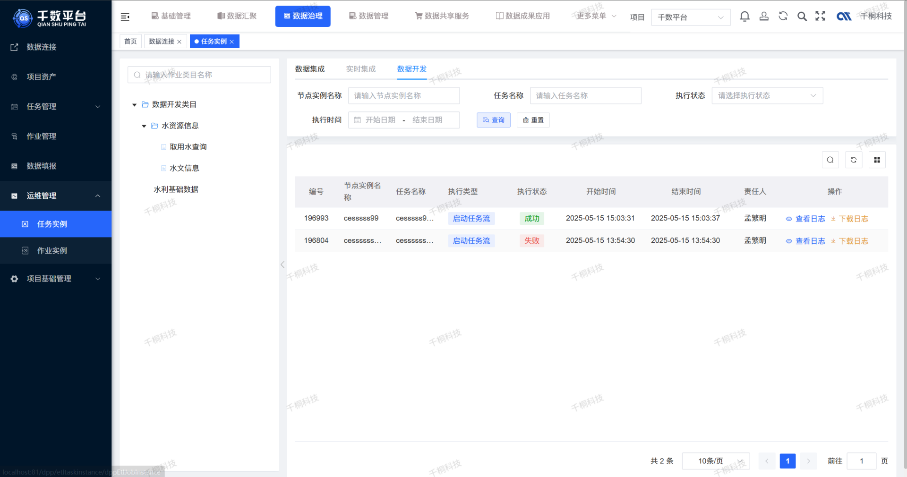
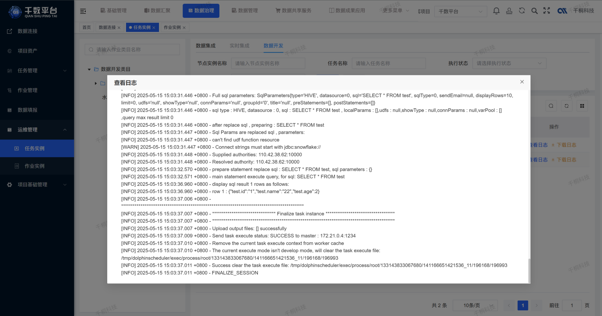

  
 
 
 
 

 
 

  📖简体中文 | <a href="README.en.md">📖English</a>

## 🌈平台简介
**千数平台（qData）** 是一款一**站式开源数据中台**，覆盖**中台基础建设、数据治理、数据开发、监控告警、数据服务**与**数据可视化**等核心能力，致力于高效赋能数据前台，为各类业务系统提供**统一、高效、安全**的数据支撑服务。

✨✨✨**演示地址**✨✨✨ <a href="https://qdata-demo.qiantong.tech" target="_blank">点击跳转</a> ，账号：qData 密码：qData123

## 🍱 使用场景

| 场景                 | 描述                                                                 |
|----------------------|----------------------------------------------------------------------|
| 🔗 **多源数据整合**   | 整合业务系统、IoT、第三方等数据，实现统一采集、清洗与治理，构建标准数据资产。 |
| 🌐 **统一数据服务**   | 将治理数据通过 API 或数据集方式提供，支撑系统共享调用，提升复用效率。       |
| 📈 **决策分析支撑**   | 提供统一数据视图和分析能力，助力业务分析、报表生成及科学决策。             |

## 💡 优势

| 优势点                 | 描述                                                                                   |
|------------------------|----------------------------------------------------------------------------------------|
| 🧩 **统一标准**         | 建立统一的数据规范、模型和指标体系，消除“数据孤岛”，提升全局协同效率。                |
| ⚙️  **敏捷支撑**         | 快速响应业务变化，按需提供数据服务和分析支持，加速业务创新。                         |
| 🔒 **安全可控**         | 数据权限精细化管理，保障数据合规使用，支撑审计与监管要求。                           |

## ✅ 已有功能一览

| 功能模块   | 功能描述                                                                                                                        | 状态     |
|--------|-----------------------------------------------------------------------------------------------------------------------------------|--------|
| 系统管理   | 包含系统配置、用户与权限管理、运行监控、日志管理、服务器资源监控和工作空间管理，支持将任务拆分给不同项目组协作，适应前店后厂的工作流程。 | ✅ 完成  |
| 数据标准管理 | 管理逻辑模型（表级，支持关联数据元）和数据元模型（字段级，绑定规范、稽查与清洗），实现结构化数据规范和质量管控。                          | ✅ 完成  |
| 数据集成（ETL） | 支持数据库、文件、消息队列等多种数据源接入，提供可视化ETL设计、多任务调度与监控，支持数据清洗规则应用，包含运行日志和执行配置管理。          | ✅ 完成  |
| 元数据管理  | 集中管理数据表、字段、稽查、清洗指标等元信息，建立统一的数据资产目录，支撑数据查找、血缘分析和结构维护。                              | ✅ 完成  |
| 数据质量管理 | 支持基于预置的稽查规则及数据清洗规则，实现对数据准确性、一致性和完整性的自动校验与修正。                                      | ✅ 完成  |
| 数据资产管理 | 通过目录结构对数据资产进行分级分类管理，支持全生命周期跟踪与维护。                                                           | ✅ 完成  |
| 统一标签管理     |   支持标签自动生成与多维度标签筛选，便于数据分类和精准检索。                                                                                                                          | ✅ 完成  |
| 数据开发   | 支持达梦8、MySQL、Oracle、人大金仓等主流数据库任务开发，包含调度配置和日志管理，基于数据仓库，通过SQL及大数据脚本结合业务需求开发和加工业务数据。 | ✅ 完成  |
| 数据查询   | 提供灵活且高效的交互式查询工具，支持快速分析和挖掘结构化数据。                                                               | ✅ 完成  |
| 数据服务管理 | 将数据资产封装为 API 服务，支持外部 API 接口转发，包含 API 日志、数据脱敏、数据接口和服务接口管理及调用日志监控。                  | ✅ 完成    |

## 🚧 未来开发计划

| 功能模块               | 功能描述                                                           | 状态       |
|------------------------|----------------------------------------------------------------|----------|
| 作业调度中心           | 实现任务编排、任务依赖管理、定时执行、失败重试、日志追踪等调度能力，提升任务执行的自动化与可控性。              | 🔨 开发中   |
| 数据集成（增强）       | 增强异构数据源、文件、接口、网络爬虫的采集与同步能力，支持更多类型转换与接入能力。                      | 🔨 开发中   |
| 离线数据开发           | 支持基于 Spark、Hive、SQL 等任务类型的离线数据处理，适用于大批量数据的周期性加工与分析，规划统一的作业管理与执行入口。              | 🔨 开发中   |
| 实时数据开发           | 支持基于 Flink、Kafka 等流处理引擎的实时任务开发，实现低延迟数据处理与指标计算，适用于实时监控与事件驱动业务场景。              | ⏳ 规划中    |
| 数据质量管理（增强）   | 基于规则引擎实现数据质量检测，支持质量报告生成及质量指标的监控与统计，辅助识别和改进数据中的准确性与完整性问题。             | ⏳ 规划中    |
| 数据比对管理           | 支持数据库连接配置及任务调度，自动执行结构和内容比对任务，生成详细日志，便于跨源数据一致性验证。               | ⏳ 规划中    |
| 元数据管理（扩展）     | 增强数据字段、数据地图、SQL 控制台、变更记录等元数据功能，逐步实现血缘、影响分析与结构可视化。              | ⏳ 规划中    |
| 数据血缘分析           | 支持字段级血缘追踪与可视化图谱展示，帮助用户清晰理解数据流向与依赖关系，提升数据透明度与可追溯性。              | ⏳ 规划中    |
| 数据图谱管理       | 基于数据仓库构建业务实体、事实表与维度表之间的图谱关系，支持多层模型梳理与可视化展示，增强对数据逻辑结构和业务依赖的理解与维护能力。 | ⏳ 规划中    |
| 数据可视化             | 支持 BI 报表、数据看板、大屏和多种数据图表展示，支持拖拽配置、权限控制与动态联动。                    | ⏳ 规划中    |
| AI 辅助开发与治理 | 引入 AI 技术，重点支持离线与实时数据开发中的SQL智能补全、自动优化、异常检测及调试辅助，提升开发效率和数据质量。 | ⏳ 规划中    |

💡 如您有好的建议或功能需求，欢迎 [提交Issue](https://gitee.com/qiantongtech/qData/issues)，与我们共同完善数据中台功能。

## 🚨 默认端口
| 端口号   | 协议  | 说明                             |
|-------| ----- | -------------------------------- |
| 8080  | http  | 平台前端默认端口                  |
| 8081  | http  | 平台后端默认端口                  |
| 2181  | tcp   | ZooKeeper 默认客户端连接端口  |
| 8020  | tcp   | Hadoop HDFS NameNode RPC 端口     |
| 9870  | http  | Hadoop HDFS NameNode Web UI端口 |
| 9000  | tcp   | Hadoop HDFS 默认FS端口（部分配置）|
| 10000 | tcp   | HiveServer2 默认端口              |
| 9083  | tcp   | Hive Metastore Thrift 服务端口    |
| 16010 | http  | HBase Master Web UI 端口          |
| 60010 | http  | HBase RegionServer Web UI 端口    |
| 7077  | tcp   | Spark Master 端口                  |
| 8080  | http  | Spark Master Web UI 端口           |
| 4040  | http  | Spark 应用程序 Web UI 端口 |
| 18080 | http  | Spark History Server Web UI 端口  |

**访问地址**：127.0.0.1:81，账号：qData 密码：qData123

[//]: # (## 🧩 架构图)

[//]: # (![framework.png]&#40;images%2Fframework.png&#41;)

## 🛠️ 技术栈
qData 平台采用前后端分离架构，后端基于 Spring Boot，前端基于 Vue 3，整合常用中间件与数据工具，构建一站式数据中台解决方案。

### 🖥️ 后端技术栈

| 分类           | 技术                            | 描述                       |
|----------------|----------------------------------|----------------------------|
| 服务框架       | Spring Boot                     | 提供快速开发能力             |
| 权限控制       | Spring Security                 | 实现用户权限认证与控制         |
| 数据库         | MySQL、PostgreSQL、达梦8、人大金仓 | 持久化存储与配置管理         |
| ORM 框架       | MyBatis-Plus                    | 简化数据库操作               |
| 缓存与并发控制 | Redis                           | 支持缓存、分布式锁等         |
| 消息队列       | RabbitMQ                        | 实现异步通信与解耦处理       |

### 🌐 前端技术栈

| 分类     | 技术        | 描述             |
|----------|-------------|------------------|
| 框架     | Vue 3       | 现代化响应式框架   |
| 组件库   | Element UI  | 常用 UI 组件支持   |
| 构建工具 | Vite        | 快速开发与构建工具 |

### 🧩 第三方依赖

| 分类                 | 组件 / 工具       | 描述                                               |
|----------------------|------------------|----------------------------------------------------|
| 数据仓库             | Hive             | 支持数据建模、分区管理及元数据维护                 |
| 计算引擎与数据集成   | Spark            | 批流一体，支持 ETL 数据处理                    |
| 大数据存储           | Hive、HBase      | 支持海量非结构化与半结构化数据存储                 |
| 作业调度与任务管理   | DolphinScheduler | 提供可视化任务编排、依赖管理及调度能力             |

## 🏗️ 部署要求
在部署 qData 之前，请确保以下环境和工具已正确安装：

### 🖥️ 服务端环境要求（后端）

| 项目            | 推荐版本     | 说明                  |
|---------------|--------------|---------------------|
| JDK           | 1.8 或以上   | 建议使用 OpenJDK 8 或 11 |
| Maven         | 3.6+         | 项目构建与依赖管理           |
| 达梦8           |  8.0   | 关系型数据库（可切至MySQL）    |
| Redis         | 5.0+         | 缓存与消息功能支持           |
| RabbitMQ | 可选         |用于任务调度、异步通信等功能。           |
| 操作系统          | Windows / Linux / Mac | 通用环境均可运行            |

### 🌐 前端环境要求（可选，若需本地构建）

| 项目             | 推荐版本 | 说明                   |
|------------------|------|------------------------|
| Node.js          | 16+  | 构建工具依赖           |
| npm | 10+  | 包管理器|
| Vite   | 最新版  | 脚手架工具              |

## 🚨 商用授权
> **版权申明**：
> - 产品的迭代更新需要大家支持，在第三方获取到的商业版本源码，没有可靠性且未经授权，由此带来的法律后果自行承担。
> - 授权用户不能直接销售和分发 **千数平台（qData）** 商业版源码。
> - 授权用户二次开发和修改部分的源码可以申请软件著作权，不可以申请 **千数平台（qData）** 源码部分的软件著作权。

| 系统版本 | 开源版本                          | 商业版本                                             |
|------|-------------------------------|--------------------------------------------------|
| 许可协议 | 遵循Apache License 2.0协议（可商用，不可去除 Logo 和版权） | 永久商业授权（包含源码、文档及品牌使用授权），购买后提供发票/合同和授权书 |
| 系统用途 | 商业项目可用，适合学习、评估、初步部署等轻量级使用场景 | 适用于政企项目、定制化开发、正式生产环境部署等中大型场景 |
| 系统功能 | 数据标准、数据集成、数据资产、数据开发、系统管理等 | 开源版所有功能、数据集成（增强）、实时数据开发、数据血缘分析、数据可视化、AI 辅助开发与治理等 |
| 授权费用 | 免费，可商用（如需修改 Logo 和版权，品牌授权费3万元） | 20万元 |
| 相关服务 | 定期更新 | 加入商业版私有仓库，赠送一年的订阅更新 |
| 技术支持 | QQ群交流 | 企业用户群交流，提供必要技术支持 |
| 代码更新 | Gitee、Github更新 | Git私服更新 |

## 🚀 快速开始
👉 点击下方按钮，查看完整的安装与部署指南：

<a href="DEPLOY.md">🧭 查看快速开始文档</a>

## 👥 QQ交流群
欢迎加入 qData 官方 QQ 交流群，获取最新动态、技术支持与使用交流。

## 🖼️ 系统配图
<table>
    <tr>
        <td></td>
        <td></td>
    </tr>
    <tr>
        <td></td>
        <td></td>
    </tr>
    <tr>
        <td></td>
        <td></td>
    </tr>
    <tr>
        <td></td>
        <td></td>
    </tr>
    <tr>
        <td></td>
        <td></td>
    </tr>
    <tr>
        <td></td>
        <td></td>
    </tr>
    <tr>
        <td></td>
        <td></td>
    </tr>
    <tr>
        <td></td>
        <td></td>
    </tr>
</table>
