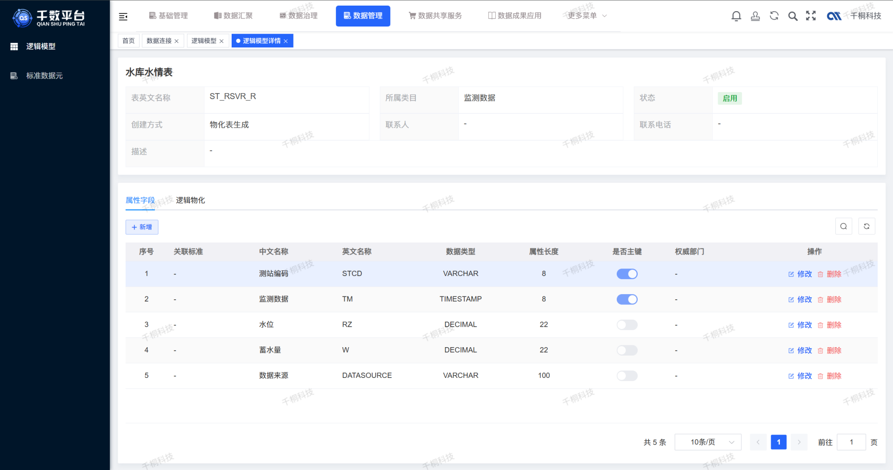
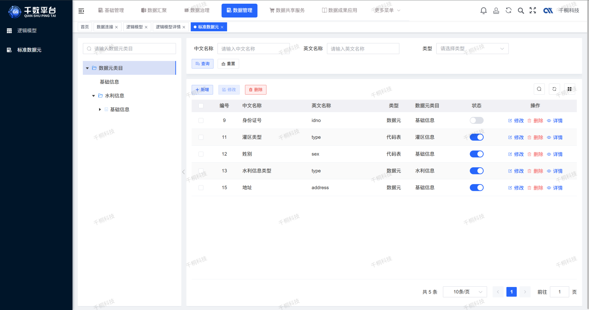
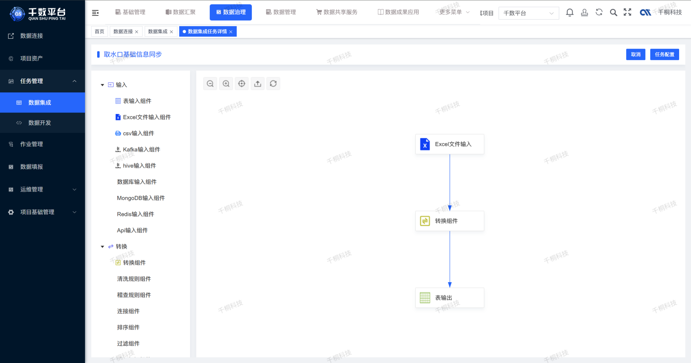

  
 
 
 
 

 
 

  📖简体中文 | <a href="README.en.md">📖English</a>

## 🌈平台简介
**千数平台（qData）** 是一款一**站式开源数据中台**，覆盖**中台基础建设、数据治理、数据开发、监控告警、数据服务**与**数据可视化**等核心能力，致力于高效赋能数据前台，为各类业务系统提供**统一、高效、安全**的数据支撑服务。

✨✨✨**演示地址**✨✨✨ [**点击跳转**](https://gitee.com/qiantongtech/qData)

## 🍱 使用场景

| 场景                   | 描述                                                                                   |
|------------------------|----------------------------------------------------------------------------------------|
| 🔗 **多源数据整合**     | 打通业务系统、IoT、第三方平台等多源数据，实现统一采集、清洗、治理，构建标准化数据资产。   |
| 🌐 **统一数据服务**     | 将治理后的数据以 API 或数据集形式对外提供，支撑业务系统共享调用，提升复用效率。           |
| 📈 **决策分析支撑**     | 提供统一的数据视图和分析能力，助力业务分析、报表生成和管理层科学决策。                   |

## 💡 优势

| 优势点                 | 描述                                                                                   |
|------------------------|----------------------------------------------------------------------------------------|
| 🧩 **统一标准**         | 建立统一的数据规范、模型和指标体系，消除“数据孤岛”，提升全局协同效率。                |
| ⚙️  **敏捷支撑**         | 快速响应业务变化，按需提供数据服务和分析支持，加速业务创新。                         |
| 🔒 **安全可控**         | 数据权限精细化管理，保障数据合规使用，支撑审计与监管要求。                           |

## ✨ 已有功能
- [x] **`系统管理`** 包含系统配置、运行监控、服务器资源管理等功能。
- [x] **`数据标准管理`** 管理逻辑模型（表级，支持关联数据元）和数据元模型（字段级，绑定规范、稽查与清洗），实现结构化数据规范和质量管控。
- [x] **`数据集成`** 包含项目管理、数据源接入、可视化 ETL 流程设计，多任务作业管理及详情查看、运行日志和执行配置。
- [x] **`作业调度中心`** 任务编排、依赖管理、定时执行、失败重试、日志追踪等。
- [x] **`数据服务管理`** 将数据资产封装为 API 服务，支持外部 API 接口转发，包含 API 日志、数据脱敏（Mask）、数据接口和服务接口管理及调用日志监控，提升服务管理能力。
- [x] **`数据质量管理`** 支持基于预置的稽查规则及数据清洗规则，实现对数据准确性、一致性和完整性的自动校验与修正。
- [x] **`数据开发`** 支持达梦8、MySQL、Oracle 等主流数据库的任务开发任务。
## 🌱 未来开发计划
- [ ] **`数据查询`** 提供灵活且高效的交互式查询工具，支持快速分析和挖掘结构化数据。
- [ ] **`元数据管理`** 包含数据字段、数据地图、数据查询、数据源、SQL控制台、行级变更等功能。
- [ ] **`数据比对管理`** 支持数据库连接配置及任务调度，自动执行比对任务并生成详细日志，便于数据一致性验证。
- [ ] **`数据质量管理`** 通过规则引擎驱动自动化质量检测，生成质量报告并提供实时监控和统计，保障数据准确性和完整性。
- [ ] **`数据开发`** 增加对 Spark、Flink 和 SQL 等多种数据开发任务的支持，实现高效灵活的数据处理与计算。
- [ ] **`数据资产管理`** 通过目录结构对数据资产进行分级分类管理，支持全生命周期跟踪与维护。
- [ ] **`数据权限管理（细粒度）`** 实现字段级与行级的精细化数据访问控制，支持灵活权限配置。
- [ ] **`数据血缘分析`** 支持字段级血缘追踪，提供图谱化可视化展示，支持查看数据流向与依赖分析。
- [ ] **`监控与告警中心`** 平台运行监控、资源使用情况、服务健康状况等集中告警管理。
- [ ] **`数据可视化`** 支持 BI 报表、数据看板、大屏和多种数据图表的展示。

## 🚨 默认端口
| 端口号   | 协议  | 说明                             |
|-------| ----- | -------------------------------- |
| 8080  | http  | 平台前端默认端口                  |
| 8081  | http  | 平台后端默认端口                  |
| 2181  | tcp   | ZooKeeper 默认客户端连接端口  |
| 8020  | tcp   | Hadoop HDFS NameNode RPC 端口     |
| 9870  | http  | Hadoop HDFS NameNode Web UI端口 |
| 9000  | tcp   | Hadoop HDFS 默认FS端口（部分配置）|
| 10000 | tcp   | HiveServer2 默认端口              |
| 9083  | tcp   | Hive Metastore Thrift 服务端口    |
| 16010 | http  | HBase Master Web UI 端口          |
| 60010 | http  | HBase RegionServer Web UI 端口    |
| 7077  | tcp   | Spark Master 端口                  |
| 8080  | http  | Spark Master Web UI 端口           |
| 4040  | http  | Spark 应用程序 Web UI 端口 |
| 18080 | http  | Spark History Server Web UI 端口  |

**访问地址**：127.0.0.1:8080，账号：qData 密码：qData123

[//]: # (## 🧩 架构图)

[//]: # (![framework.png]&#40;images%2Fframework.png&#41;)

## 🛠️ 技术栈
qData 平台采用前后端分离架构，后端基于 Spring Boot，前端基于 Vue 3，整合常用中间件与数据工具，构建一站式数据中台解决方案。

### 🖥️ 后端技术栈

| 分类           | 技术                            | 描述                       |
|----------------|----------------------------------|----------------------------|
| 服务框架       | Spring Boot                     | 提供快速开发能力             |
| 权限控制       | Spring Security                 | 实现用户权限认证与控制         |
| 数据库         | MySQL、PostgreSQL、达梦8、人大金仓 | 持久化存储与配置管理         |
| ORM 框架       | MyBatis-Plus                    | 简化数据库操作               |
| 缓存与并发控制 | Redis                           | 支持缓存、分布式锁等         |
| 消息队列       | RabbitMQ                        | 实现异步通信与解耦处理       |

### 🌐 前端技术栈

| 分类     | 技术        | 描述             |
|----------|-------------|------------------|
| 框架     | Vue 3       | 现代化响应式框架   |
| 组件库   | Element UI  | 常用 UI 组件支持   |
| 构建工具 | Vite        | 快速开发与构建工具 |

### 🧩 第三方依赖

| 分类                 | 组件 / 工具       | 描述                                               |
|----------------------|------------------|----------------------------------------------------|
| 数据仓库             | Hive             | 支持数据建模、分区管理及元数据维护                 |
| 计算引擎与数据集成   | Spark            | 批流一体，支持 ETL 数据处理                    |
| 大数据存储           | Hive、HBase      | 支持海量非结构化与半结构化数据存储                 |
| 作业调度与任务管理   | DolphinScheduler | 提供可视化任务编排、依赖管理及调度能力             |

## 🏗️ 部署要求
在部署 qData 之前，请确保以下环境和工具已正确安装：

### 🖥️ 服务端环境要求（后端）

| 项目            | 推荐版本     | 说明                  |
|---------------|--------------|---------------------|
| JDK           | 1.8 或以上   | 建议使用 OpenJDK 8 或 11 |
| Maven         | 3.6+         | 项目构建与依赖管理           |
| 达梦8           |  8.0   | 关系型数据库（可切至MySQL）    |
| Redis         | 5.0+         | 缓存与消息功能支持           |
| rabbitmq | 可选         | RabbitMQ 作为消息中间件，用于任务调度、异步通信等功能。           |
| 操作系统          | Windows / Linux / Mac | 通用环境均可运行            |

### 🌐 前端环境要求（可选，若需本地构建）

| 项目             | 推荐版本 | 说明                   |
|------------------|------|------------------------|
| Node.js          | 16+  | 构建工具依赖           |
| npm | 10+  | 包管理器|
| Vite   | 最新版  | 脚手架工具              |

## 🚀 快速开始
👉 点击下方按钮，查看完整的安装与部署指南：

<a href="DEPLOY.md">🧭 查看快速开始文档</a>

## 👥 QQ交流群
欢迎加入 qData 官方 QQ 交流群，获取最新动态、技术支持与使用交流。

## 🖼️ 系统配图
<table>
    <tr>
        <td></td>
        <td></td>
    </tr>
    <tr>
        <td></td>
        <td></td>
    </tr>
    <tr>
        <td></td>
        <td></td>
    </tr>
    <tr>
        <td></td>
        <td></td>
    </tr>
    <tr>
        <td></td>
        <td></td>
    </tr>
    <tr>
        <td></td>
        <td></td>
    </tr>
    <tr>
        <td></td>
        <td></td>
    </tr>
    <tr>
        <td></td>
        <td></td>
    </tr>
</table>
