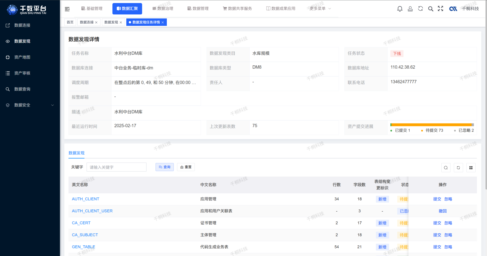
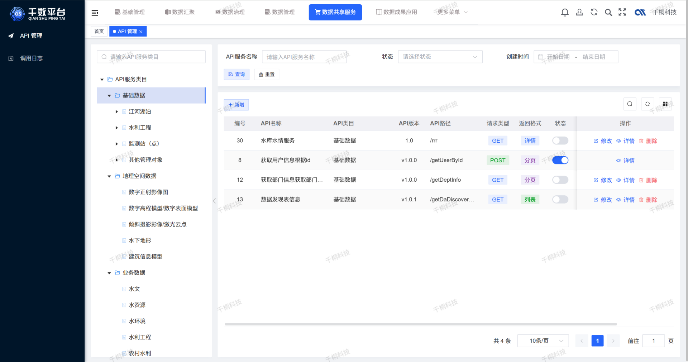

  
 
 
 
 

 
 

  📖简体中文 | <a href="README.en.md">📖English</a>

## 🌈平台简介
千数平台（qData）是一款一站式开源数据中台，覆盖中台数据集成、基础建设、数据治理、数据开发、监控告警、数据服务与数据可视化等核心能力。 平台采用**高效、灵活、可扩展**的架构设计，支持多源数据的统一整合与标准化治理，助力各类业务系统实现数据资产化、服务化与价值释放。通过强大的数据处理能力和**低门槛**的开发工具，qData 为前台应用提供稳定、安全、高性能的数据支撑，全面赋能数据驱动的智能决策与业务升级。

✨✨✨**在线文档**✨✨✨ <a href="https://qdata.qiantong.tech" target="_blank">https://qdata.qiantong.tech</a> 

✨✨✨**演示地址**✨✨✨ <a href="https://qdata-demo.qiantong.tech" target="_blank">https://qdata-demo.qiantong.tech</a> ，账号：qData 密码：qData123

✨✨✨**商业版演示地址**✨✨✨ <a href="https://qdata-pro.qiantong.tech" target="_blank">点击跳转</a> ，演示账号请联系客服获取
## 🍱 使用场景
适用于希望通过整合、治理和**分析多源数据，打破孤岛、提升质量与效率**，实现数据驱动与业务创新的企业和机构。无论是大型企业、中小企业，还是政府机构，均可通过千数平台（qData）实现数据资产化与价值释放。

| 场景               | 描述                                                                 |
|--------------------|----------------------------------------------------------------------|
| **数据整合治理**     | 面向存在多来源数据的企业或机构，如业务系统、数据库、IoT 设备及外部合作方，需统一采集、整合与治理数据，构建高质量的数据资产体系。 |
| **提升质量效率**  | 针对数据质量参差不齐、清洗复杂、处理效率低下的问题，亟需标准化和自动化手段以提高数据处理效能。         |
| **打破数据孤岛** | 企业内部存在多个独立运行的信息系统，数据分散难以整合，迫切需要打通系统壁垒，实现数据高效流通与共享。     |
| **驱动决策创新**  | 希望通过统一数据视图和分析能力，支持科学决策，同时挖掘数据潜力推动产品优化、服务创新与商业模式转型。     |
| **数字化转型**   | 正在推进或规划数字化转型的企业与政府机构，需构建稳定高效的数据支撑平台，提升组织整体数字化能力与运营效率。 |

## 💡 优势

| 优势点                 | 描述                                                                                   |
|------------------------|----------------------------------------------------------------------------------------|
| **高效数据集成**             | 数据集成模块对标 Kettle，兼容性强、使用成本更低。                     |
| **全栈功能，业务闭环**       | 覆盖数据全生命周期，构建端到端业务闭环能力。                         |
| **轻量部署，灵活扩展**       | 支持单节点部署，轻量高效，按需弹性扩展。                             |
| **高性能处理，小节点大吞吐** | 单节点每分钟处理千万级数据，性能强劲，资源利用率高。                 |
| **批流一体，多引擎支持**     | 统一平台支持批处理与流处理，兼容 Spark、Flink 等多种执行引擎。        |
| **全类型数据资产管理**       | 支持结构化与非结构化数据的统一管理，资产清晰、可视、可控。           |
| **数据质量合规可靠**         | 符合国家标准 GB/T 36344，全面保障数据质量与一致性。                  |
| **开发与生产环境一体化**     | 任务配置可跨环境复用，实现开发、测试、生产环境高效协同。             |

## ✅ 已有功能一览

| 功能模块   | 功能描述                                                                                    | 状态     |
|--------|-----------------------------------------------------------------------------------------|--------|
| **数据集成（ETL）** | 支持数据库、文件、消息队列等多种数据源的**无缝接入**，提供**直观的 ETL 设计界面**、多任务调度与实时监控，内置**丰富的**数据清洗规则，对标 Kettle，以**更低成本**助力数据流转。 | ✅ 完成  |
| **数据资产** | 通过目录结构对数据资产进行**精细化**分级分类，覆盖从创建到销毁的全**生命周期**管理，确保每一份数据得到妥善处理，提升资产可见性与可控性。                        | ✅ 完成  |
| **数据服务** | 将数据资产封装为 **API 服务**，支持外部 API 接口转发，提供日志管理、数据脱敏、接口管理及调用日志监控等功能，实现数据服务能力标准化与可管可控。              | ✅ 完成  |
| **数据标准** | 管理逻辑模型（表级关联数据元）和数据元模型（字段级绑定规范、稽查与清洗规则），为结构化数据制定**统一标准**，保障数据质量达到企业级要求。                      | ✅ 完成  |
| **数据质量** | 利用预置的稽查规则和数据清洗规则，对数据的准确性、一致性、完整性进行自动化校验与修正，保障数据持续处于高质量状态，满足治理要求。                        | ✅ 完成  |
| **元数据管理** | 集中管理数据表、字段、稽查、清洗指标等元信息，构建统一的数据资产目录，支持便捷查找、血缘分析和结构维护，提升数据管理效率。                           | ✅ 完成  |
| **标签管理** | 支持自动生成多维度标签，提供强大筛选与精准检索能力，使数据分类、定位与使用更高效，提升业务响应速度。                                      | ✅ 完成  |
| **数据开发** | 支持达梦8、MySQL、Oracle、人大金仓等主流数据库任务开发，结合 SQL 与大数据脚本，灵活处理数据，支撑复杂场景下的数据建模与加工需求。               | ✅ 完成  |
| **数据查询** | 提供灵活高效的交互式查询工具，帮助用户快速分析与挖掘结构化数据中的深层价值，提升数据探索与决策支持能力。                                    | ✅ 完成  |
| **系统管理** | 覆盖系统配置、用户与权限管理、运行与日志监控、资源监控及工作空间管理，支持跨项目组任务拆分与协作，适应前店后厂式组织流程。                           | ✅ 完成  |
## 🚧 未来开发计划

| 功能模块               | 功能描述                                                           | 状态       |
|------------------------|----------------------------------------------------------------|----------|
| **数据集成（增强）**     | 支持异构数据源、文件、接口及网络爬虫的统一采集与同步，扩展数据转换类型与接入方式，提升多源异构数据整合能力，满足企业多样化数据集成需求。         | 🔨 开发中 |
| **作业调度中心**         | 实现任务编排、依赖管理、定时执行、失败重试、日志追踪等核心调度能力，全面提升任务执行的自动化水平与流程可控性，适用于复杂任务流的统一调度与集中管理。 | 🔨 开发中 |
| **数据血缘分析**         | 支持字段级血缘追踪与图谱化展示，全面梳理数据流转路径与依赖关系，帮助用户清晰理解数据来源与流向，提升数据可追溯性与治理精准度。                 | ⏳ 规划中 |
| **数据图谱管理**         | 基于数据仓库构建业务实体、事实表与维度表之间的图谱关系，支持多层级模型梳理与可视化展示，增强对数据逻辑结构与业务依赖的理解与管理能力。           | ⏳ 规划中 |
| **实时数据开发**         | 基于 Flink、Kafka 等流处理引擎构建实时任务开发能力，支持低延迟数据处理与动态指标计算，适用于实时监控、预警推送与事件驱动型业务场景。             | ⏳ 规划中 |
| **数据质量管理（增强）** | 基于规则引擎实现数据质量检测机制，支持质量报告生成与指标统计分析，自动识别数据准确性、完整性、一致性问题，助力企业构建高质量数据治理体系。       | ⏳ 规划中 |
| **数据比对管理**         | 支持数据库连接配置与任务调度，自动执行结构与内容比对任务，生成比对日志，有效验证跨源数据一致性，提升数据校验效率与问题排查能力。               | ⏳ 规划中 |
| **元数据管理（扩展）**   | 扩展字段级元数据、数据地图、SQL 控制台与变更记录等能力，逐步构建数据血缘分析、影响分析与结构可视化体系，提升数据资产可维护性与治理透明度。         | ⏳ 规划中 |
| **离线数据开发**         | 支持基于 Spark、Hive、SQL 等任务类型的离线数据处理，适用于大规模数据的周期性加工与分析，提供统一的作业管理入口与执行调度机制，提升批量处理效率与稳定性。 | ⏳ 规划中 |
| **数据可视化**           | 提供 BI 报表、数据看板、大屏展示等多种可视化能力，支持拖拽式配置、权限控制与图表联动，助力业务人员快速洞察数据价值。                          | ⏳ 规划中 |
| **AI 辅助开发与治理**     | 引入 AI 技术，支持离线与实时数据开发中的 SQL 智能补全、自动优化、异常检测与调试辅助，显著提升开发效率、代码质量与问题响应能力。                | ⏳ 规划中 |

💡 如您有好的建议或功能需求，欢迎 [提交Issue](https://gitee.com/qiantongtech/qData/issues)，与我们共同完善数据中台功能。

[//]: # (## 🧩 架构图)

[//]: # (![framework.png]&#40;images%2Fframework.png&#41;)

## 🛠️ 技术栈
qData 平台采用前后端分离架构，后端基于 Spring Boot，前端基于 Vue 3，整合常用中间件与数据工具，构建一站式数据中台解决方案。

<table>
  <tr>
    <th>分类</th><th>技术</th><th>描述</th>
  </tr>
  <tr>
    <td rowspan="6">后端技术栈</td><td>Spring Boot</td><td>提供快速开发能力</td>
  </tr>
  <tr>
    <td>Spring Security</td><td>实现用户权限认证与控制</td>
  </tr>
  <tr>
    <td>MySQL、PostgreSQL、达梦8、人大金仓</td><td>持久化存储与配置管理</td>
  </tr>
  <tr>
    <td>MyBatis-Plus</td><td>简化数据库操作</td>
  </tr>
  <tr>
    <td>Redis</td><td>支持缓存、分布式锁等</td>
  </tr>
  <tr>
    <td>RabbitMQ</td><td>实现异步通信与解耦处理</td>
  </tr>

  <tr>
    <td rowspan="3">前端技术栈</td><td>Vue 3</td><td>现代化响应式框架</td>
  </tr>
  <tr>
    <td>Element UI</td><td>常用 UI 组件支持</td>
  </tr>
  <tr>
    <td>Vite</td><td>快速开发与构建工具</td>
  </tr>

  <tr>
    <td rowspan="4">第三方依赖</td><td>Hive</td><td>支持数据建模、分区管理及元数据维护</td>
  </tr>
  <tr>
    <td>Spark</td><td>批流一体，支持 ETL 数据处理</td>
  </tr>
  <tr>
    <td>Hive、HBase</td><td>支持海量非结构化与半结构化数据存储</td>
  </tr>
  <tr>
    <td>DolphinScheduler</td><td>提供可视化任务编排、依赖管理及调度能力</td>
  </tr>
</table>

## 🏗️ 部署要求
在部署 qData 之前，请确保以下环境和工具已正确安装：

### 🖥️ 服务端环境要求

<table>
  <tr>
    <th>环境</th><th>项目</th><th>推荐版本</th><th>说明</th>
  </tr>
  <tr>
    <td rowspan="6">后端</td><td>JDK</td><td>1.8 或以上</td><td>建议使用 OpenJDK 8 或 11</td>
  </tr>
  <tr>
    <td>Maven</td><td>3.6+</td><td>项目构建与依赖管理</td>
  </tr>
  <tr>
    <td>达梦8</td><td>8.0</td><td>关系型数据库（可切至MySQL）</td>
  </tr>
  <tr>
    <td>Redis</td><td>5.0+</td><td>缓存与消息功能支持</td>
  </tr>
  <tr>
    <td>RabbitMQ</td><td>可选</td><td>用于任务调度、异步通信等功能</td>
  </tr>
  <tr>
    <td>操作系统</td><td>Windows / Linux / Mac</td><td>通用环境均可运行</td>
  </tr>

  <tr>
    <td rowspan="3">前端</td><td>Node.js</td><td>16+</td><td>构建工具依赖</td>
  </tr>
  <tr>
    <td>npm</td><td>10+</td><td>包管理器</td>
  </tr>
  <tr>
    <td>Vite</td><td>最新版</td><td>脚手架工具</td>
  </tr>
</table>

## 🚨 商用授权

👉 如需在商业场景中使用千知平台，请点击下方按钮查看商用授权详情：

[💼 了解授权详情](https://qdata.qiantong.tech/business.html)

## 🚀 快速开始
👉 点击下方按钮，查看完整的安装与部署指南：

<a href="DEPLOY.md">🧭 查看快速开始文档</a>

## 👥 QQ交流群
欢迎加入 qData 官方 QQ 交流群，获取最新动态、技术支持与使用交流。

## 🖼️ 系统配图
<table>
    <tr>
        <td></td>
        <td></td>
    </tr>
    <tr>
        <td></td>
        <td></td>
    </tr>
    <tr>
        <td></td>
        <td></td>
    </tr>
    <tr>
        <td></td>
        <td></td>
    </tr>
    <tr>
        <td></td>
        <td></td>
    </tr>
    <tr>
        <td></td>
        <td></td>
    </tr>
    <tr>
        <td></td>
        <td></td>
    </tr>
    <tr>
        <td></td>
        <td></td>
    </tr>
</table>
