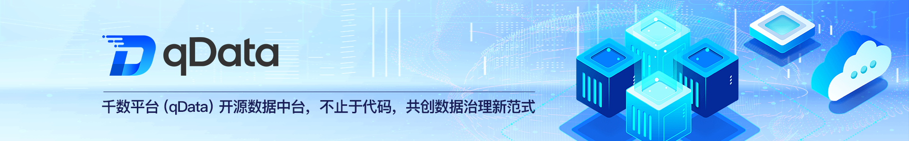

  
 
 
 
 

 
 
 

  📖简体中文 | <a href="README.md">📖English</a> | <a href="README.ja.md">📖日本語</a>

## 🌈 平台简介
**qData 数据中台**是一套面向企业数据治理与数据研发场景的开源数据中台，围绕 **ETL 数据集成、数据开发、数据建模、元数据管理、数据质量、数据资产、API 数据服务与 AI 智能问数**等核心能力，支持 MySQL、DM8、Oracle、SQL Server、Kingbase8、Doris 等常用数据库接入，帮助企业快速完成数据接入、清洗转换、资产编目、质量检查、接口开放和 Text2SQL 分析，可作为企业建设数据中台、数据治理平台、ETL 平台和数据服务平台的开源基础底座，也适合开发者进行二次开发与功能扩展。

✨✨✨**在线文档**✨✨✨ <a href="https://community.qdata.tech" target="_blank">https://community.qdata.tech</a> 

✨✨✨**开源版演示地址**✨✨✨ <a href="https://demo.qdata.tech" target="_blank">https://demo.qdata.tech</a> ，账号：qData 密码：qData123

✨✨✨**专业版演示地址**✨✨✨ <a href="https://pro-demo.qdata.tech" target="_blank">https://pro-demo.qdata.tech</a> ，演示账号请 [联系客服获取](https://community.qdata.tech/business/policy.html)

> 如果 qData 对您有帮助，请点个 **Star ⭐️**，这是我们持续更新的最大动力！ 🚀

## 🍱 使用场景

qData 开源版适用于企业、政府机构、科研院校及开发团队建设数据中台、ETL 数据集成、数据治理、数据资产管理与数据服务能力，也可作为数据治理平台或数据研发平台的二次开发底座。

| 场景 | 描述 | 典型客户类型 |
| --- | --- | --- |
| **ETL 数据集成** | 通过可视化方式配置数据接入、清洗转换和输出流程，支撑业务数据汇聚与处理。 | 数据研发团队、软件公司 |
| **数据治理建设** | 统一管理数据标准、数据模型、元数据、数据质量和数据资产，建立基础治理体系。 | 政府机构、集团企业、科研院校 |
| **数据资产管理** | 对数据表、字段、标签、类目等资产进行统一编目，提升数据查找和复用效率。 | 数据管理部门、公共服务机构 |
| **API 数据服务** | 将数据表或 SQL 查询结果封装为 API 服务，支持数据接口开放与系统集成。 | 平台研发团队、集成服务商 |
| **智能问数分析** | 支持自然语言问数、Text2SQL 查询与结果分析，降低业务人员用数门槛。 | 业务分析团队、运营团队 |
| **二次开发底座** | 基于开源能力扩展数据集成、数据治理和数据服务功能，降低从零研发成本。 | 开发者、ISV 厂商、项目交付团队 |

## 💡 优势

| 优势点 | 描述 |
| --- | --- |
| **开源可二开** | 提供开源数据中台基础能力，适合企业、开发者和项目团队按业务需求进行二次开发与功能扩展。 |
| **可视化 ETL** | 支持通过可视化方式配置数据接入、清洗转换和输出流程，降低数据集成任务的开发门槛。 |
| **治理能力完整** | 覆盖数据标准、数据建模、元数据管理、数据质量、数据资产等核心治理能力，帮助企业建立基础数据治理体系。 |
| **多源数据接入** | 开源版支持 MySQL、Oracle、达梦8 等常用数据库接入，满足常见业务系统数据管理需求。 |
| **数据服务开放** | 支持将数据表或 SQL 查询结果封装为 API 服务，并提供在线测试、调用日志和应用管理能力。 |
| **AI 智能问数** | 支持自然语言问数、Text2SQL 和智能图表分析，降低业务人员查询和分析数据的使用门槛。 |
| **轻量易部署** | 适合快速部署、验证和试用，可作为企业数据中台、ETL 平台或数据治理平台的开源基础底座。 |
| **专业版平滑升级** | 开源版可用于前期验证和基础场景建设，复杂数据治理、整库同步、主数据、数据安全、BI 可视化等需求可升级专业版。 |

## ✅ 已有功能一览

| 模块 | 描述 |
| --- | --- |
| **数据集成（ETL）** | 支持可视化配置数据接入、清洗转换和输出流程，适用于常见业务数据汇聚、加工和同步场景。 |
| **数据开发** | 支持通过 SQL 脚本方式进行数据处理任务开发，适用于数据加工、统计分析和周期性处理等场景。 |
| **数据建模** | 支持数据标准、数仓分层、数据分域、主题规划、逻辑模型和标准数据元等能力，帮助企业建立基础数据模型体系。 |
| **元数据管理** | 支持元数据查看、字段结构查看、版本管理和元数据比对，便于了解数据表结构、字段信息及版本变化。 |
| **数据质量** | 支持基于稽查规则的数据质量检查与处理，可用于发现数据完整性、唯一性、有效性等问题。 |
| **数据资产** | 支持数据资产编目、资产标签、资产详情、资产查询等能力，帮助用户统一管理和检索数据资源。 |
| **数据查询** | 支持通过 SQL 在线查询数据源中的数据，便于进行临时查询、数据验证和结果导出。 |
| **数据服务** | 支持将数据表或 SQL 查询结果封装为 API 服务，并提供在线测试、调用日志和应用管理能力。 |
| **AI 智能问数** | 支持自然语言问数、Text2SQL、智能图表和结果明细查看，降低业务人员使用数据的门槛。 |
| **基础管理** | 支持数据源、项目空间、类目、稽查规则、清洗规则等基础配置，为数据研发和数据治理提供支撑。 |
| **系统管理** | 支持用户、角色、菜单、部门、岗位、字典、参数、公告和日志等基础系统管理能力。 |

👉 qData 数据中台采用模块化设计，当前开源版聚焦数据集成、数据开发、数据建模、元数据、数据质量、数据资产、数据服务和智能问数等核心能力。更多功能可参考：[qData 功能清单总览](https://community.qdata.tech/docs/start/features.html)

## 🚧 未来开发计划

| 功能名称 | 功能描述 |
| --- | --- |
| **元数据采集任务** | 规划支持按数据源配置元数据采集任务，可设置采集范围、采集对象和执行策略，用于自动采集表、字段等元数据信息。 |
| **元数据采集实例** | 规划记录每次元数据采集的执行实例，展示运行状态、执行时间、采集结果和日志信息，便于追踪采集过程。 |
| **最新元数据** | 规划展示当前最新采集到的元数据内容，包括表结构、字段信息、数据类型、字段描述等，方便用户查看数据结构现状。 |
| **定版元数据** | 规划支持将元数据按版本进行固化管理，便于记录关键时间点的数据结构状态，支撑后续版本追溯和变更核查。 |
| **元数据比对** | 规划支持不同版本元数据之间的结构差异比对，帮助用户识别字段新增、删除、类型变化和描述变化等内容。 |
| **业务分层** | 规划完善面向数仓规划的业务分层能力，支持按业务场景、数据域或主题对模型进行更清晰的组织和管理。 |
| **模型发布** | 规划支持将逻辑模型发布为物理模型或数据表结构，打通从模型设计到落地使用的流程。 |
| **数据资产重构** | 规划重构数据资产模块，优化资产编目、资产详情、资产检索、资产标签和资产维护体验。 |
| **数据集成增强** | 持续扩展 ETL 组件、转换算子和数据源类型，提升复杂数据接入、清洗转换和输出任务的配置能力。 |
| **数据质量增强** | 持续扩展稽查规则、清洗规则和质量报告能力，提升数据质量问题发现、分析和处理效率。 |
| **数据服务增强** | 优化 API 服务发布、接口测试、调用日志、应用授权和限流控制能力，提升数据服务开放体验。 |
| **AI 能力增强** | 持续优化 Text2SQL、智能图表、问数结果解释和数据洞察能力，提升自然语言分析体验。 |

💡 如您有好的建议或功能需求，欢迎 [提交 Issue](https://gitee.com/qiantongtech/qData/issues)，与我们共同完善 qData 数据中台。
[//]: # (## 🧩 架构图)

[//]: # (![framework.png]&#40;images%2Fframework.png&#41;)

## 🛠️ 技术栈
qData 平台采用前后端分离架构，后端基于 Spring Boot，前端基于 Vue 3，并整合了部分主流中间件与数据工具。

<table>
  <tr>
    <th>分类</th><th>技术</th><th>描述</th>
  </tr>
  <tr>
    <td rowspan="6">后端技术栈</td><td>Spring Boot</td><td>提供快速开发能力</td>
  </tr>
  <tr>
    <td>Spring Security</td><td>实现用户权限认证与控制</td>
  </tr>
  <tr>
    <td>MySQL、PostgreSQL、达梦8、人大金仓</td><td>持久化存储与配置管理</td>
  </tr>
  <tr>
    <td>MyBatis-Plus</td><td>简化数据库操作</td>
  </tr>
  <tr>
    <td>Redis</td><td>支持缓存、分布式锁等</td>
  </tr>
  <tr>
    <td>RabbitMQ</td><td>实现异步通信与解耦处理</td>
  </tr>

  <tr>
    <td rowspan="3">前端技术栈</td><td>Vue 3</td><td>现代化响应式框架</td>
  </tr>
  <tr>
    <td>Element UI</td><td>常用 UI 组件支持</td>
  </tr>
  <tr>
    <td>Vite</td><td>快速开发与构建工具</td>
  </tr>

  <tr>
    <td rowspan="4">第三方依赖</td><td>DolphinScheduler</td><td>提供可视化任务编排、依赖管理及调度能力</td>
  </tr>
  <tr>
    <td>Spark</td><td>批流一体，支持 ETL 数据处理</td>
  </tr>
  <tr>
    <td>Hive</td><td>支持数据建模、分区管理及元数据维护</td>
  </tr>
  <tr>
    <td>Hive、HBase</td><td>支持海量非结构化与半结构化数据存储</td>
  </tr>
</table>

## 🏗️ 部署要求

在部署 qData 之前，请确保以下环境和工具已正确安装：

<table>
  <tr>
    <th>环境</th><th>项目</th><th>推荐版本</th><th>说明</th>
  </tr>
  <tr>
    <td rowspan="6">后端</td><td>JDK</td><td>1.8 或以上</td><td>建议使用 OpenJDK 8 或 11</td>
  </tr>
  <tr>
    <td>Maven</td><td>3.6+</td><td>项目构建与依赖管理</td>
  </tr>
  <tr>
    <td>达梦8</td><td>8.0</td><td>关系型数据库（可切至MySQL）</td>
  </tr>
  <tr>
    <td>Redis</td><td>5.0+</td><td>缓存与消息功能支持</td>
  </tr>
  <tr>
    <td>RabbitMQ</td><td>可选</td><td>用于任务调度、异步通信等功能</td>
  </tr>
  <tr>
    <td>操作系统</td><td>Windows / Linux / Mac</td><td>通用环境均可运行</td>
  </tr>

  <tr>
    <td rowspan="3">前端</td><td>Node.js</td><td>16+</td><td>构建工具依赖</td>
  </tr> 
  <tr>
    <td>npm</td><td>10+</td><td>包管理器</td>
  </tr>
  <tr>
    <td>Vite</td><td>最新版</td><td>脚手架工具</td>
  </tr>
</table>

## 🚨 商用授权

qData 提供 **专业版** 与 **开源版** 两种形态，满足不同规模与场景下的用户需求。两者既各具特色，又形成互补：开源版更像启蒙老师，帮助低成本起步；专业版更像专家顾问，提供深度与保障。无论选择哪种版本，qData 都将成为可靠的伙伴，帮助企业释放数据价值，加速数字化进程。

👉 如需 **开源版品牌授权** 或 **咨询专业版**，请点击按钮查看详情：[💼 了解授权详情](https://community.qdata.tech/business/policy.html)

## 🚀 快速开始

| 部署方式                    | 说明                                                              | 适用场景               |
| ----------------------- | --------------------------------------------------------------- | ------------------ |
| [Docker Compose 部署](https://community.qdata.tech/docs/deploy/docker-compose-deployment.html) | 所有组件（调度器、数据库、消息队列、Spark、Flink 等）以及 qData 数据中台源码都通过 Docker Compose 一键启动 | **初学者快速上手**、功能演示、测试环境  |
| [使用源代码本地启动](https://community.qdata.tech/docs/deploy/build-from-source.html)  | qData 数据中台源码由开发者本地运行，依赖组件通过 Docker Compose 启动  | **日常开发**、功能联调          |
| [自主部署（纯手工安装）](https://community.qdata.tech/docs/deploy/manual-deployment/)  | 所有依赖组件及 qData 数据中台服务均需手工安装和配置  | **生产环境**、大规模部署、个性化定制场景 |

👉 查看完整的安装与部署指南：<a href="https://community.qdata.tech/docs/deploy/deploy-open-source.html">🧭 点击查看详细部署步骤</a>

## 👥 QQ交流群
欢迎加入 qData 官方 QQ 交流群，获取最新动态、技术支持与使用交流。

👉 <a href="https://community.qdata.tech/discuss.html">点击加入 QQ 交流群</a>

<!-- 

 -->

## 🖼️ 系统配图
<table>
    <tr>
        <td>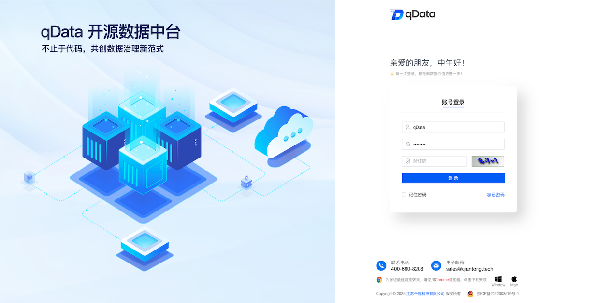</td>
        <td>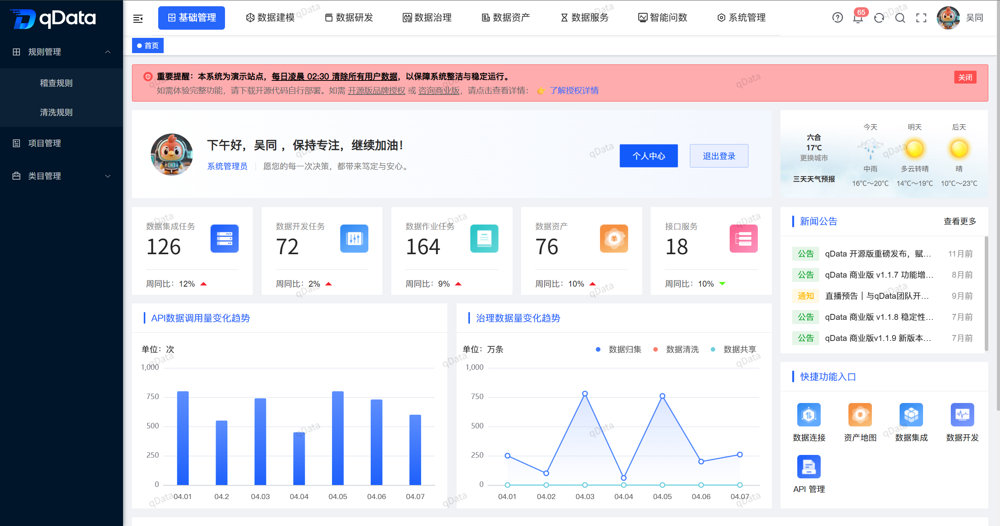</td>
    </tr>
    <tr>
        <td>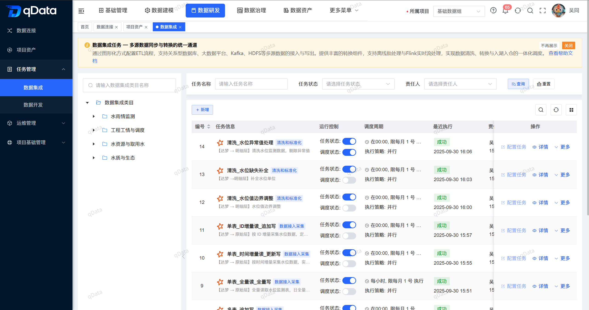</td>
        <td>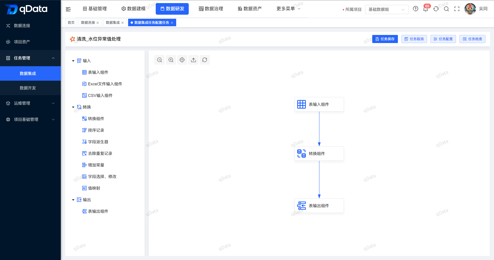</td>
    </tr>
    <tr>
        <td>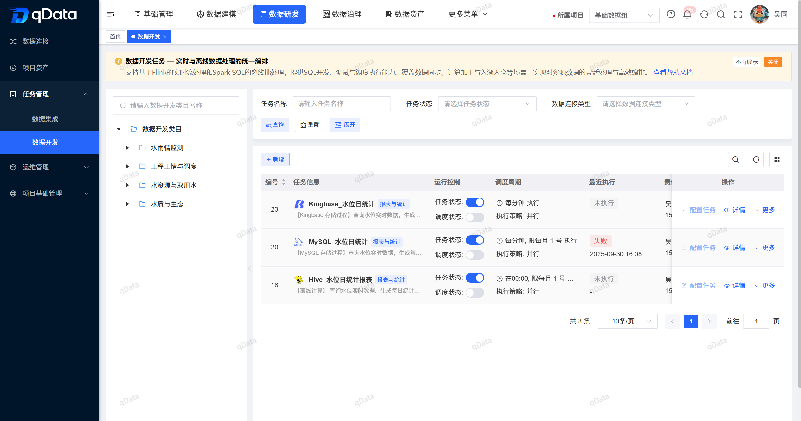</td>
        <td>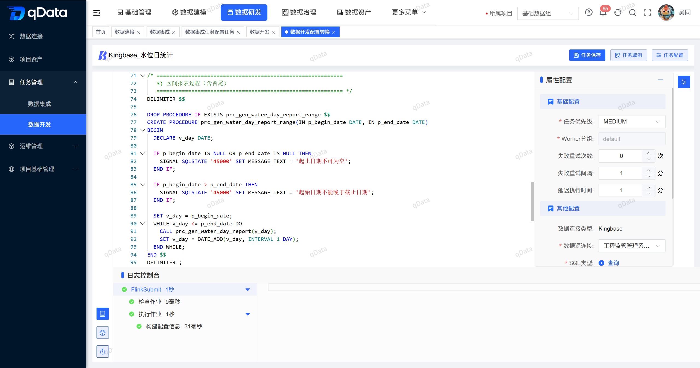</td>
    </tr>
    <tr>
        <td>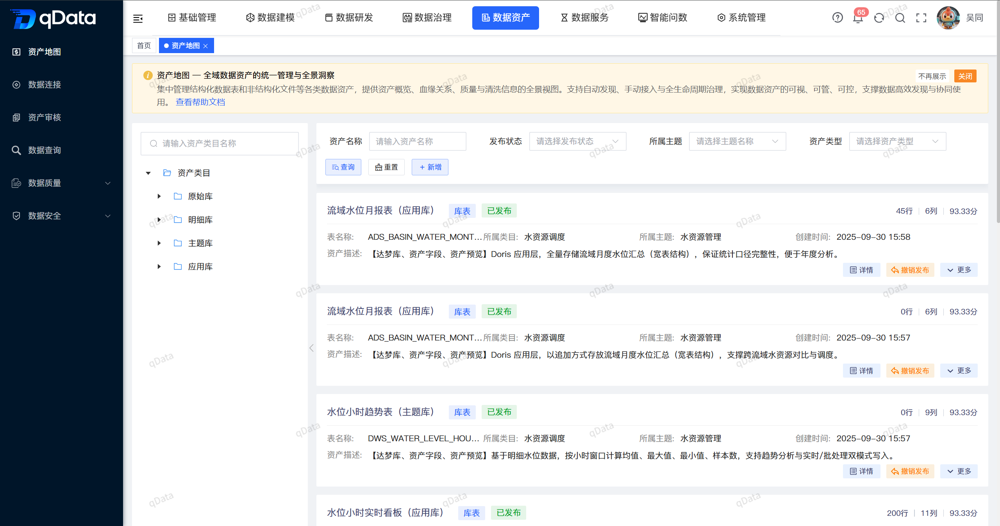</td>
        <td>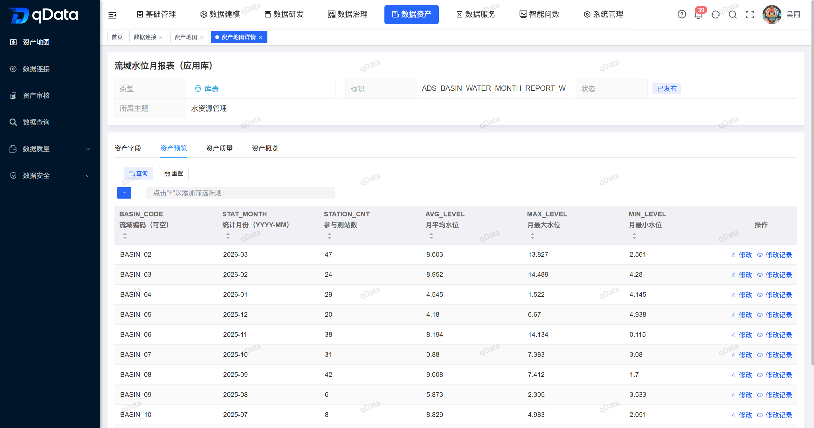</td>
    </tr>
    <tr>
        <td>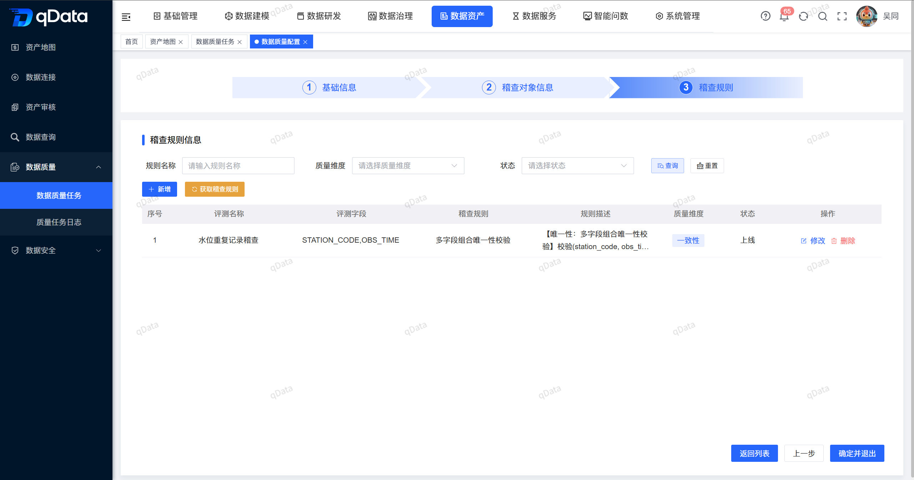</td>
        <td>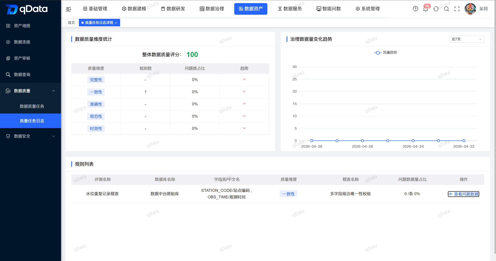</td>
    </tr>
    <tr>
        <td>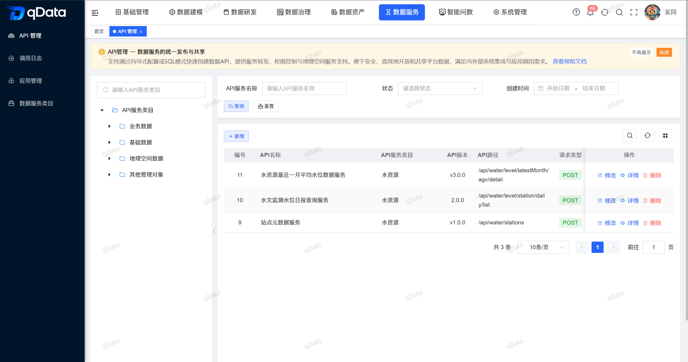</td>
        <td>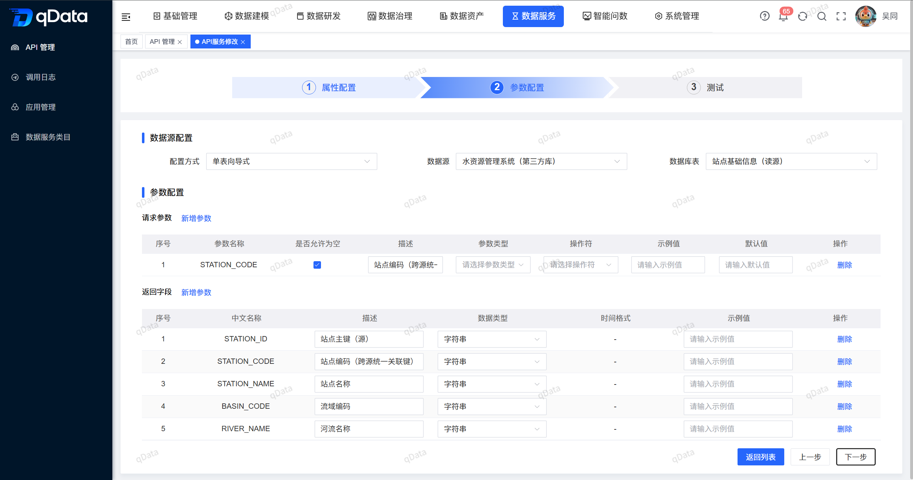</td>
    </tr>
    <tr>
        <td>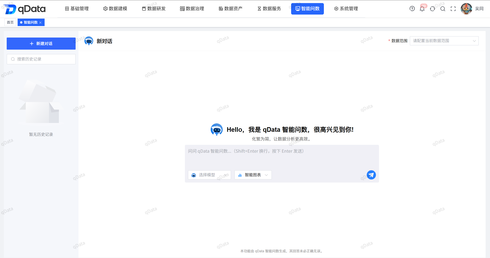</td>
        <td>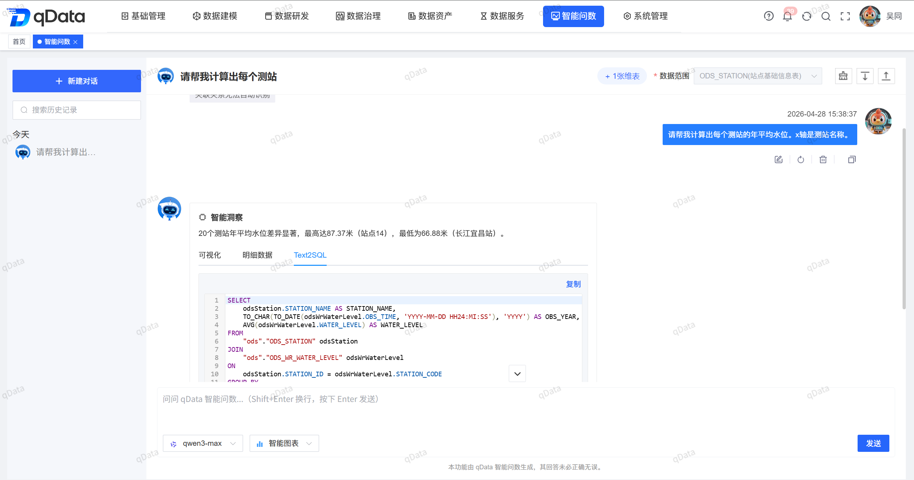</td>
    </tr>
</table>
