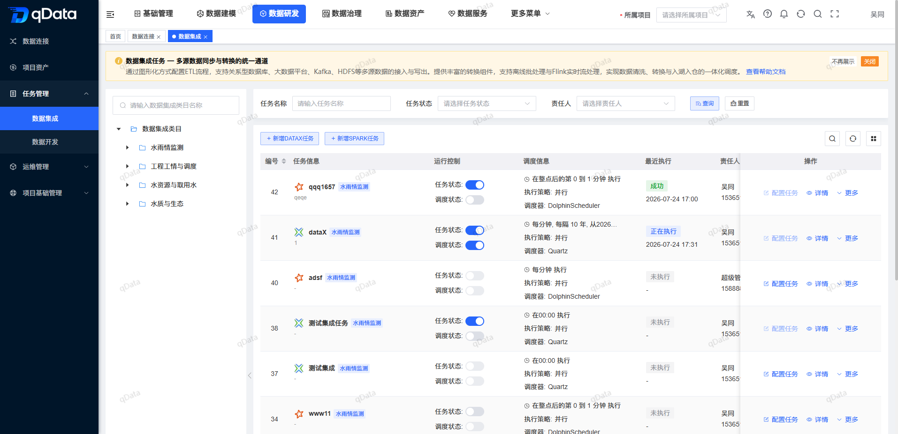
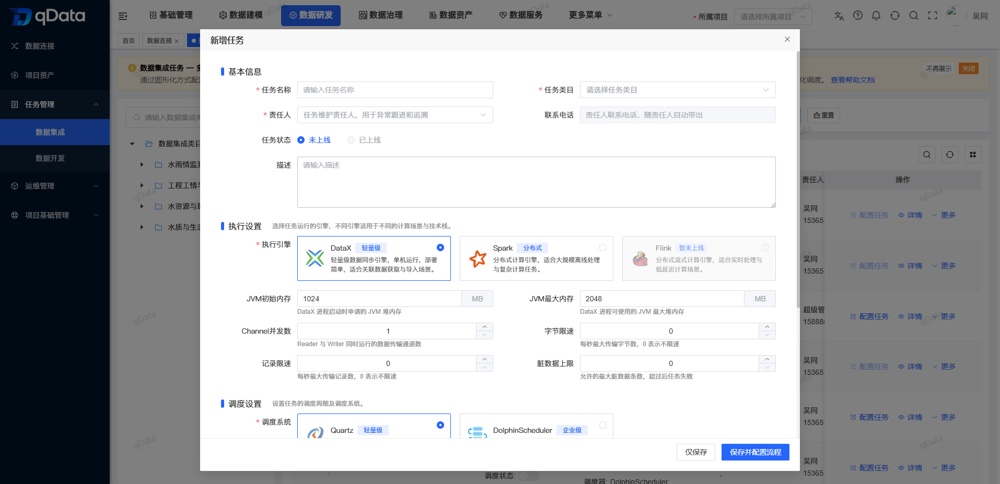
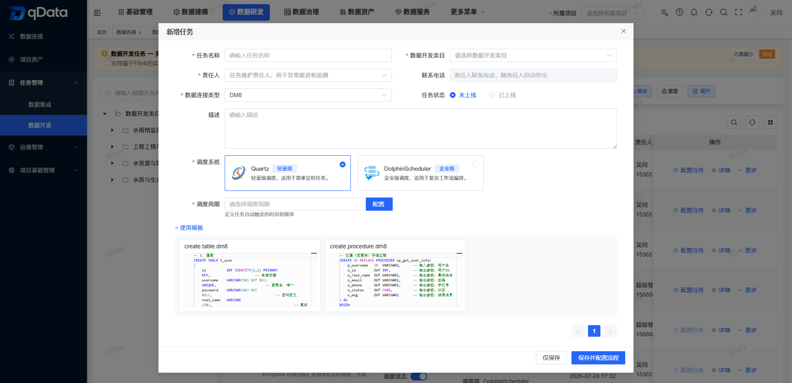
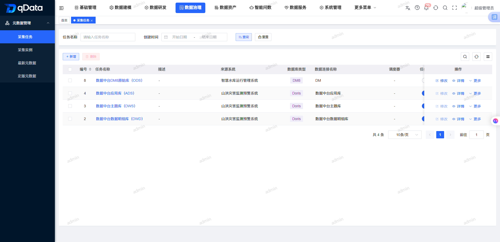
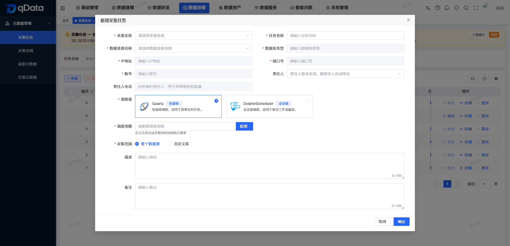

  
 
 
 
 

 
 
 

  📖简体中文 | <a href="README.md">📖English</a> | <a href="README.ja-JP.md">📖日本語</a>

## 🌈 平台简介
**qData 数据中台**是一套面向企业数据治理与数据研发场景的开源数据中台，围绕 **ETL 数据集成、数据开发、数据建模、元数据管理、数据质量、数据资产、API 数据服务与 AI 智能问数**等核心能力，支持 MySQL、DM8、Oracle、SQL Server、Kingbase8、Doris 等常用数据库接入，帮助企业快速完成数据接入、清洗转换、资产编目、质量检查、接口开放和 Text2SQL 分析，可作为企业建设数据中台、数据治理平台、ETL 平台和数据服务平台的开源基础底座，也适合开发者进行二次开发与功能扩展。

✨✨✨**在线文档**✨✨✨ <a href="https://community.qdata.tech" target="_blank">https://community.qdata.tech</a>

✨✨✨**开源版演示地址**✨✨✨ <a href="https://demo.qdata.tech" target="_blank">https://demo.qdata.tech</a> ，账号：qData 密码：qData123

✨✨✨**专业版演示地址**✨✨✨ <a href="https://pro-demo.qdata.tech" target="_blank">https://pro-demo.qdata.tech</a> ，演示账号请 [联系客服获取](https://community.qdata.tech/business/policy.html)

> 如果 qData 对您有帮助，请点个 **Star ⭐️**，这是我们持续更新的最大动力！ 🚀

## ✅ 功能清单

> 👉 qData 数据中台采用模块化设计，当前开源版聚焦数据集成、数据开发、数据建模、元数据、数据质量、数据资产、数据服务和智能问数等核心能力。更多功能可参考：[qData 功能清单总览](https://community.qdata.tech/business/pro/features.html)

| 模块 | 描述 |
| --- | --- |
| **数据集成（ETL）** | 支持可视化配置数据接入、清洗转换和输出流程，新建任务可选择 DataX 或 Spark 执行引擎，适用于轻量数据同步、关联数据获取、数据导入、大规模离线处理和复杂计算场景。 |
| **数据开发** | 支持通过 SQL 脚本方式进行数据处理任务开发，新建任务可选择 Quartz 或 DolphinScheduler 调度器，适用于数据加工、统计分析、周期调度和任务编排等场景。 |
| **数据建模** | 支持数据标准、数仓分层、数据分域、主题规划、逻辑模型和标准数据元等能力，帮助企业建立基础数据模型体系。 |
| **元数据管理** | 支持元数据查看、字段结构查看、版本管理、元数据比对和采集任务管理，采集任务新建时可选择 Quartz 或 DolphinScheduler 调度器，便于灵活配置采集执行策略。 |
| **数据质量** | 支持基于稽查规则的数据质量检查与处理，可用于发现数据完整性、唯一性、有效性等问题。 |
| **数据资产** | 支持数据资产编目、资产标签、资产详情、资产查询等能力，帮助用户统一管理和检索数据资源。 |
| **数据查询** | 支持通过 SQL 在线查询数据源中的数据，便于进行临时查询、数据验证和结果导出。 |
| **数据服务** | 支持将数据表或 SQL 查询结果封装为 API 服务，并提供在线测试、调用日志和应用管理能力。 |
| **AI 智能问数** | 支持自然语言问数、Text2SQL、智能图表和结果明细查看，降低业务人员使用数据的门槛。 |
| **基础管理** | 支持数据源、项目空间、类目、稽查规则、清洗规则等基础配置，为数据研发和数据治理提供支撑。 |
| **系统管理** | 支持用户、角色、菜单、部门、岗位、字典、参数、公告和日志等基础系统管理能力。 |

## 🚧 未来开发计划

后续将计划推进 **元数据比对、业务分层和数据资产重构**，进一步完善数据治理与资产管理体验。同时持续增强 **数据集成、数据质量、数据服务和 AI 能力**，扩展数据源与 ETL 组件，优化质量规则、API 服务及 Text2SQL 分析体验。

> 💡 如您有好的建议或功能需求，欢迎 [提交 Issue](https://gitee.com/qiantongtech/qData/issues)，与我们共同完善 qData 数据中台。

## 🛠️ 技术栈
qData 平台采用前后端分离架构，后端基于 Spring Boot，前端基于 Vue 3，并整合了部分主流中间件与数据工具。

<table>
  <tr>
    <th>分类</th><th>技术</th><th>描述</th>
  </tr>
  <tr>
    <td rowspan="6">后端技术栈</td><td>Spring Boot</td><td>提供快速开发能力</td>
  </tr>
  <tr>
    <td>Spring Security</td><td>实现用户权限认证与控制</td>
  </tr>
  <tr>
    <td>MySQL、PostgreSQL、达梦8、人大金仓</td><td>持久化存储与配置管理</td>
  </tr>
  <tr>
    <td>MyBatis-Plus</td><td>简化数据库操作</td>
  </tr>
  <tr>
    <td>Redis</td><td>支持缓存、分布式锁等</td>
  </tr>
  <tr>
    <td>RabbitMQ</td><td>实现异步通信与解耦处理</td>
  </tr>

  <tr>
    <td rowspan="3">前端技术栈</td><td>Vue 3</td><td>现代化响应式框架</td>
  </tr>
  <tr>
    <td>Element UI</td><td>常用 UI 组件支持</td>
  </tr>
  <tr>
    <td>Vite</td><td>快速开发与构建工具</td>
  </tr>

  <tr>
    <td rowspan="6">第三方依赖</td><td>DolphinScheduler</td><td>提供可视化任务编排、依赖管理及调度能力，可用于数据开发任务和采集任务调度</td>
  </tr>
  <tr>
    <td>Quartz</td><td>提供轻量级任务调度能力，可用于数据开发任务和采集任务调度，适合单机部署和简单周期任务场景</td>
  </tr>
  <tr>
    <td>DataX</td><td>轻量级数据同步执行引擎，单机运行、部署简单，适合关联数据获取与导入场景</td>
  </tr>
  <tr>
    <td>Spark</td><td>分布式计算执行引擎，适合大规模离线处理与复杂计算任务</td>
  </tr>
</table>

## 🚨 商用授权

qData 提供 **专业版** 与 **开源版** 两种形态，满足不同规模与场景下的用户需求。两者既各具特色，又形成互补：开源版更像启蒙老师，帮助低成本起步；专业版更像专家顾问，提供深度与保障。无论选择哪种版本，qData 都将成为可靠的伙伴，帮助企业释放数据价值，加速数字化进程。

> 👉 如需 **开源版品牌授权** 或 **咨询专业版**，请点击按钮查看详情：[💼 了解授权详情](https://community.qdata.tech/business/policy.html)

## 🚀 快速开始
第一次接触 qData，推荐按下面的顺序体验：

1. **在线体验**：登录演示环境，无需安装即可了解主要功能。
2. **本地部署**：通过 Docker Compose 在本机启动完整环境。
3. **源码启动**：需要二次开发时，再从源码启动前后端服务。

### 1. 在线体验

- 登录[社区开源版演示环境](#-平台简介)，无需安装即可了解主要功能。

### 2. 选择部署方式

- [本地部署](https://community.qdata.tech/docs/deploy/docker-compose-deployment.html) ：通过 Docker Compose 在本机启动完整环境。
- [源码启动](https://community.qdata.tech/docs/deploy/build-from-source.html) ：需要二次开发时，再从源码启动前后端服务。
- [自主部署](https://community.qdata.tech/docs/deploy/manual-deployment/) ：手工安装、配置并管理各项服务，适合生产环境、大规模部署和个性化配置。

> 👉 完整指南：https://community.qdata.tech/docs/deploy/deploy-open-source.html

## 🏗️ 部署环境

在部署 qData 之前，请确保以下环境和工具已正确安装：

<table>
  <tr>
    <th>环境</th><th>项目</th><th>推荐版本</th><th>说明</th>
  </tr>
  <tr>
    <td rowspan="6">后端</td><td>JDK</td><td>1.8 或以上</td><td>建议使用 OpenJDK 8 或 11</td>
  </tr>
  <tr>
    <td>Maven</td><td>3.6+</td><td>项目构建与依赖管理</td>
  </tr>
  <tr>
    <td>达梦8</td><td>8.0</td><td>关系型数据库（可切至MySQL）</td>
  </tr>
  <tr>
    <td>Redis</td><td>5.0+</td><td>缓存与消息功能支持</td>
  </tr>
  <tr>
    <td>RabbitMQ</td><td>可选</td><td>用于任务调度、异步通信等功能</td>
  </tr>
  <tr>
    <td>操作系统</td><td>Windows / Linux / Mac</td><td>通用环境均可运行</td>
  </tr>

  <tr>
    <td rowspan="3">前端</td><td>Node.js</td><td>16+</td><td>构建工具依赖</td>
  </tr> 
  <tr>
    <td>npm</td><td>10+</td><td>包管理器</td>
  </tr>
  <tr>
    <td>Vite</td><td>最新版</td><td>脚手架工具</td>
  </tr>
</table>

## 👥 QQ交流群
欢迎加入 qData 官方 QQ 交流群，获取最新动态、技术支持与使用交流。

> 👉 <a href="https://community.qdata.tech/discuss.html">点击加入 QQ 交流群</a>

<!-- 

 -->

## 🖼️ 系统配图
<table>
    <tr>
        <td></td>
        <td></td>
    </tr>
    <tr>
        <td></td>
        <td></td>
    </tr>
    <tr>
        <td></td>
        <td></td>
    </tr>
    <tr>
        <td></td>
        <td></td>
    </tr>
    <tr>
        <td></td>
        <td></td>
    </tr>
    <tr>
        <td></td>
        <td></td>
    </tr>
    <tr>
        <td></td>
        <td></td>
    </tr>
    <tr>
        <td></td>
        <td></td>
    </tr>
</table>
