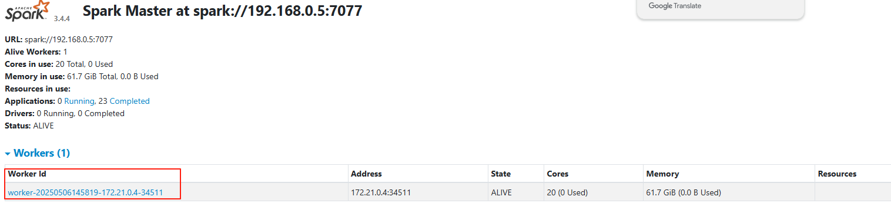

# 🚀 システム実行ガイド

<p align="center">
  <a href="../zh-CN/DEPLOY.md">📖简体中文</a> | <a href="../en/DEPLOY.md">📖English</a> | 📖日本語
</p>

## 🛠️ 一、準備作業
### システム要件

| コンポーネント | バージョン要件          |
|------|---------------|
| JDK | 1.8           |
| Node.js | 18+           |
| yarn | v1.22.22+     |
| DM8 | 大文字小文字非区別、GB18030エンコーディング |
| Redis | 5.0+          |
| RabbitMQ | バージョン指定なし         |
| Maven | 3.6+          |
| Docker | 1.13.1+       |
| Docker Compose | 1.28.0+       |

## 📁 二、ディレクトリ構造
### 2.1 プロジェクト構造&#xA;
```
├─qdata-framework           # 共通設定モジュール
├─qdata-server              # 起動プロジェクト
├─qdata-module-system       # システム管理モジュール
├─qdata-module-att          # 基本管理モジュール
├─qdata-module-dp           # データ標準管理モジュール
├─qdata-module-da           # データ資産モジュール
├─qdata-module-dpp          # データ集約モジュール
├─qdata-module-ds           # データサービスモジュール
├─qdata-api-ds              # DSスケジューラインターフェースモジュール
├─qdata-etl                 # Spark-ETLプログラムモジュール
├─qdata-ui                  # フロントエンドモジュール
├─sql                       # SQLスクリプト
├─README.md                 # プロジェクト紹介
├─DEPLOY.md                 # クイックスタート
```
### 2.2 バックエンド構造&#xA;
```
├─qdata-framework           # 共通設定モジュール
├─   ├─qdata-websocket      # WebSocketモジュール
├─   ├─qdata-security       # Securityモジュール
├─   ├─qdata-redis          # Redisモジュール
├─   ├─qdata-quartz         # 定期タスクモジュール
├─   ├─qdata-mybatis        # MyBatis設定
├─   ├─qdata-generator      # コード生成器
├─   ├─qdata-file           # ファイル管理モジュール
├─   ├─qdata-es             # ESモジュール
├─   ├─qdata-config         # 設定モジュール
├─   ├─qdata-common         # 共通モジュール
├─   ├─qdata-auth           # OAuth2モジュール
├─qdata-server              # 起動プロジェクト
├─qdata-module-system       # システム管理モジュール
├─qdata-module-att          # 基本管理モジュール
├─qdata-module-dp           # データ標準管理モジュール
├─qdata-module-da           # データ資産モジュール
├─qdata-module-dpp          # データ集約モジュール
├─qdata-module-ds           # データサービスモジュール
├─qdata-api-ds              # DSスケジューラインターフェースモジュール
├─qdata-etl                 # Spark-ETLプログラムモジュール
```

### 2.3 フロントエンド構造&#xA;

```
├─qdata-ui                  # フロントエンドモジュール
├─   ├─public                   # 静的リソースディレクトリ
├─   ├─vite.config.js           # Vite設定ファイル
├─   ├─src
├─   |  ├─views                     # ページビュー
├─   |  |   ├─system                # システム管理モジュール
├─   |  |   ├─att                   # 基本管理モジュール
├─   |  |   ├─dp                    # データ標準管理モジュール
├─   |  |   ├─da                    # データ資産モジュール
├─   |  |   ├─dpp                   # データ集約モジュール
├─   |  |   ├─ds                    # データサービスモジュール
├─   |  ├─utils                 # ユーティリティ
├─   |  ├─store                 # 状態管理
├─   |  ├─router                # ルーティング
├─   |  ├─plugins               # プラグイン
├─   |  ├─layout                # レイアウト
├─   |  ├─components            # 共通コンポーネント
├─   |  ├─assets                # 画像、スタイル等リソース
├─   |  ├─api                   # APIインターフェース
├─   ├─.env.development         # 開発環境設定
├─   ├─.env.production          # 本番環境設定
```

## 🚀 三、クイックスタート

### 3.1 Spark デプロイ（Linux環境）

#### 1. Spark ダウンロード
🔗 [Spark 3.5.5 ダウンロード](https://downloads.apache.org/spark/spark-3.5.5/spark-3.5.5-bin-hadoop3.tgz)

#### 2. Java環境の確認
```
java -version

#  期待される出力

java version "1.8.0\_441"
Java(TM) SE Runtime Environment (build 1.8.0\_441-b07)
Java HotSpot(TM) 64-Bit Server VM (build 25.441-b07, mixed mode)
```

#### 3. ファイルの解凍
```
tar -xzf spark-3.5.5-bin-hadoop3.tgz
```

#### 4. Masterノードの起動
```
cd spark/sbin

./start-master.sh
```

✅ 確認：`http://<サーバーIP>:8080` にアクセスし、Spark管理画面が表示されれば起動成功。📋 Master URL（例：`spark://127.0.0.1:7077`）を記録し、Workerノード起動に使用。


#### 5. Workerノードの起動
```
cd spark/sbin

./start-slave.sh <Master URL>  # 前ステップで記録したURLに置き換え
```

✅ 確認：Spark管理画面を更新し、「Workers」リストに新ノードが追加されているか確認。



### 3.2 DS スケジューラ起動

**1. コードの取得**
- 🔗 [百度ネットディスク](https://pan.baidu.com/s/5A7-TUZ_EujpsWO93RektIg)

**2. 起動ガイド**
🔗 [DolphinScheduler 開発環境セットアップ](https://dolphinscheduler.apache.org/ja/docs/3.2.2/contribute/development-environment-setup)

### 3.3 バックエンド設定ファイルの変更 ⚙️&#xA;

##### 1. 開発環境への切替

```
#  application.properties
spring:
 profiles:
   active: dev  # 開発環境に設定
```

##### 2. 主要パラメータの設定（application-dev.yml）
```
# メインデータソース選択
datasource:
  type: mysql # 現在mysql、dm8をサポート

# MySQL設定
mysql:
  driver-class-name: com.mysql.cj.jdbc.Driver
  url: jdbc:mysql://127.0.0.1:3306/qdata?characterEncoding=UTF-8&useUnicode=true&useSSL=false&tinyInt1isBit=false&allowPublicKeyRetrieval=true&rewriteBatchedStatements=true&serverTimezone=Asia/Shanghai
  username: <データベースユーザー名>  # 実際のユーザー名に置き換え
  password: <データベースパスワード>  # 実際のパスワードに置き換え

#  DM8データベース設定
dm8:
 driver-class-name: dm.jdbc.driver.DmDriver
 url: jdbc:dm://127.0.0.1:5236/QDATA?STU\&zeroDateTimeBehavior=convertToNull\&useUnicode=true\&characterEncoding=utf-8\&schema=QDATA\&serverTimezone=Asia/Shanghai
 username: <データベースユーザー名>  # 実際のユーザー名に置き換え
 password: <データベースパスワード>  # 実際のパスワードに置き換え

#  RabbitMQ設定
rabbitmq:
 host: 127.0.0.1
 port: 40003
 username: <ユーザー名>  # 実際のユーザー名に置き換え
 password: <パスワード>  # 実際のパスワードに置き換え

#  DSスケジューラ設定
ds:
 base_url: http://127.0.0.1:12345/dolphinscheduler
 token: <スケジューラトークン>  # スケジューラ-セキュリティセンター-トークン管理で作成
 spark:
   master_url: spark://127.0.0.1:7077  # Spark Masterアドレスと一致
   main_jar: file:/dolphinscheduler/default/resources/spark-jar/qdata-etl-3.8.8.jar  # ETLパッケージアップロード後のパス
   main_class: tech.qiantong.qdata.spark.etl.EtlApplication
```

### 3.4. データベースの初期化
1. **データベーススキーマの作成**
    - デフォルトスキーマ名：`QDATA`（MySQLのデフォルトスキーマは`qdata`）
    - 変更が必要な場合：`sql/dm/dm.sql`または`sql/mysql/mysql.sql`のスキーマ名を編集

2. **初期化スクリプトの実行**
   ```bash
   # DM8コマンドラインツールで実行
   disql SYSDBA/SYSDBA@127.0.0.1:5236 -f sql/dm/dm.sql

   # Navicatツールで実行
   sql/mysql/mysql.sql
   ```

### 3.5. バックエンドサービスの起動
```
#  QDataApplicationのmainメソッドを実行
#  成功メッセージ
(♥◠‿◠)ﾉﾞ  qData データ中台起動成功！  ლ(´ڡ\`ლ)ﾞ
```

### 3.6 フロントエンド設定と起動

#### 1. プロキシ設定（vite.config.js）
```
// プロキシ設定
server: {
 port: 81,
 host: true,
 open: true,
 proxy: {
   "/dev-api": {
     target: "http://<バックエンドIP>:<ポート番号>",  // 実際のバックエンドアドレスに置き換え、例：http://localhost:8080
     changeOrigin: true,
     rewrite: (p) => p.replace(/^\\/dev-api/, ""),
   }
 }
}
```

#### 2. 依存関係のインストール
```
cd qdata-ui

yarn install  # または npm install
```

#### 3. フロントエンドサービスの起動

```
yarn run dev  # または npm run dev
```

#### 4. ブラウザアクセス 🚀 `http://localhost:81` を開いてシステムにアクセス